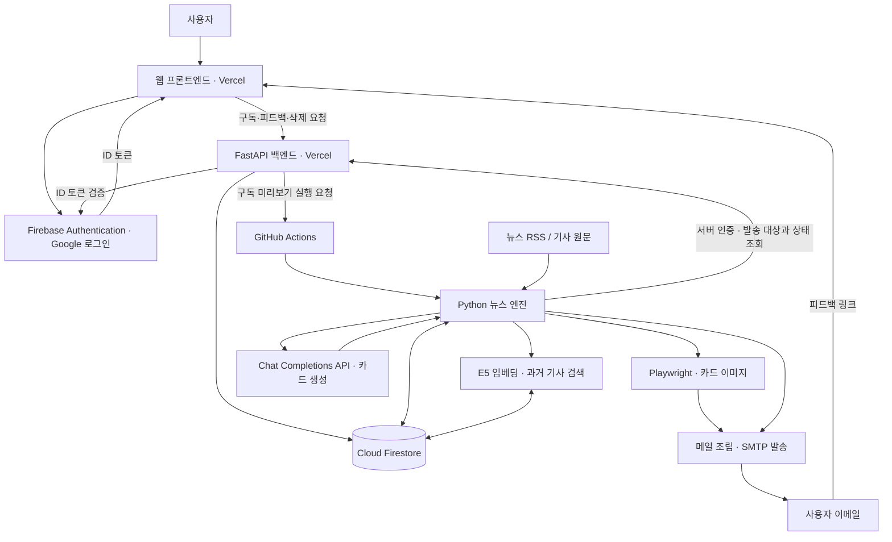

# AI 기반 개인화 뉴스 브리핑

## 프로젝트 소개

사용자가 선택한 관심 분야와 키워드로 뉴스를 선별하고, AI 뉴스 카드를 이메일로 전달하는 서비스입니다. Google 로그인 후 수신 시간과 구독 기간을 설정하고, 웹에서 구독을 관리하거나 받은 뉴스에 피드백을 남길 수 있습니다.

RSS에서 수집한 기사로 핵심 카드를 생성하며, RAG 검색에서 관련 과거 기사 근거를 확보하면 배경 카드를 추가합니다. 카드에는 기사 출처와 원문 링크를 함께 제공합니다.

## 팀원 및 역할

| 이름 | 역할 | 담당 업무 |
|---|---|---|
| 박경연 | AI / Engine | 뉴스 수집·선별, RAG, AI 카드 생성, 이미지 렌더링, 메일 발송 파이프라인 |
| 고승희 | Backend | FastAPI, Firebase 인증 검증, 사용자·구독·피드백 API, 개인정보 처리 및 DB 관리 |
| 김현서 | Frontend | 웹 화면, Google 로그인, API 연동, 구독 관리, 카드 템플릿 |
| 윤지민 | Deployment / QA | 배포·운영 안내, RSS 소스 검증, QA |

## 주요 기능

### 1. 로그인과 구독 설정

- Firebase Authentication을 통한 Google 로그인과 로그아웃
- 개인정보 수집·이용 동의 후 구독 생성
- 관심 분야 선택: 경제, IT/과학, 정치, 사회, 국제, 문화
- 관심 키워드 최대 5개 입력, 키워드당 1~20자
- 한국 시간 기준 0~23시 중 수신 시간 선택
- 1주·2주·4주 구독 기간 선택, 가입 다음 날부터 정기 발송 대상으로 처리

### 2. 구독 관리

- 현재 구독 상태, 첫 발송 예정일, 마지막 구독 날짜 조회
- 관심 분야·키워드·수신 시간 변경, 변경한 설정은 다음 날부터 적용
- 구독 해제 및 종료 후 재구독
- 계정 삭제 요청과 처리 상태 조회, 삭제 요청 후 새 발송 차단

### 3. 뉴스 선별과 카드 생성

- SBS·매일경제·경향신문 RSS와 기사 본문 수집
- 발송 예정 시각 이전 24시간의 기사 중 관심 분야에 해당하는 기사 선별
- 키워드에 일치하는 기사를 우선 선택하고, 없으면 관심 분야의 최신 기사 선택
- 최근 7일의 발송·전송 결과 불명 이력에 포함된 기사 URL은 다시 선택하지 않도록 처리
- 오늘의 핵심 카드 1장과, 과거 근거가 있는 경우 배경 카드 1장 생성
- 스토리·비교·타임라인 카드 템플릿과 원문 출처 표시

### 4. 이메일과 피드백

- 구독 직후 첫 미리보기 메일을 준비하도록 GitHub Actions 실행 요청
- SMTP를 통한 뉴스 카드 메일, 정상 수집 후 적합한 기사가 없는 경우의 안내 메일, 구독 기간 종료 안내 메일 처리
- Playwright로 카드 이미지를 렌더링해 이메일 본문에 삽입; 이미지 렌더링 실패 시 텍스트로 대체
- 발송 작업 상태 저장과 전송 직전 구독 상태 재확인
- 메일의 토큰 링크를 통한 긍정·부정 평가, 사유 선택, 의견 입력

## 기술 스택

| 구분 | 사용 기술 |
|---|---|
| AI 생성 | 코디세이 OpenAI 호환 Chat Completions API, 환경변수로 모델·API 주소 설정 |
| 임베딩 / RAG | intfloat/multilingual-e5-small, PyTorch, Transformers, Cloud Firestore 벡터 검색 |
| Backend | Python, FastAPI, Pydantic, Firebase Admin SDK |
| Frontend | HTML, CSS, JavaScript ES Modules, Firebase Authentication Web SDK |
| 뉴스 수집 | feedparser, trafilatura |
| 카드 이미지 | Node.js, Playwright / Chromium, NanumGothic |
| 데이터 / 인증 | Cloud Firestore, Firebase Authentication |
| 웹 배포 | Vercel |
| 배치 / 발송 | GitHub Actions, SMTP |

## 시스템 아키텍처



브라우저는 백엔드 API를 통해 데이터를 처리합니다. 사용자 API는 Firebase ID 토큰을 검증하고, 엔진 API는 별도의 서버용 Bearer 토큰으로 인증합니다.

## 핵심 AI 활용

### 1. 기사 기반 카드 생성 파이프라인

기사 수집 → 사용자 설정에 따른 기사 선별 → 관련 과거 기사 검색 → 프롬프트 구성 → AI 카드 생성 → 카드 검사 → 이미지 렌더링 → 메일 조립 순서로 처리합니다.

AI 응답은 JSON으로 파싱하고 카드 구조, 원문 발췌, 수치와 날짜, 출처 등을 검사합니다. 생성 상태와 결과를 저장해 완료된 결과를 재사용하고, 카드 생성 호출은 동일 생성 작업 기준 최초 호출을 포함해 최대 2회로 제한합니다. 영문 카드의 한국어 변환은 별도의 번역 단계에서 처리합니다.

### 2. RAG 파이프라인

- 기사 제목과 본문을 E5 모델로 384차원 벡터로 변환해 Firestore 기사 문서에 저장합니다.
- 선택한 기사와 같은 분야의 과거 기사 중 본문·출처·임베딩 상태가 유효한 문서를 검색합니다.
- 코사인 거리로 최대 5개 후보를 검색하고, 기본 유사도 기준 0.85 이상인 근거를 최대 3개 사용합니다.
- 검색 결과와 실제 사용한 근거 기사 ID를 저장합니다.
- 관련 근거가 없거나 검색에 실패하면 배경 카드를 생략하고 핵심 카드만 생성합니다.

관련 구현: [임베딩](engine/embeddings.py), [Firestore RAG](engine/firestore_rag.py), [카드 생성 연결](engine/card_builder.py)

### 3. 개인화 데이터와 이력 관리

개인화는 저장된 관심 분야·키워드·수신 시간과 구독 설정 버전을 기준으로 동작합니다. 기사 선별에는 최근 발송 이력을 사용하며, 사용자 피드백은 별도로 저장합니다. 현재 개인화 로직은 명시적으로 선택한 설정과 발송 이력을 사용합니다.

## 프로젝트 구조

```text
ai-news-card/
├── frontend/           # 웹 화면, Firebase 로그인, 카드 템플릿, Vercel 빌드
├── backend/            # FastAPI, 사용자·구독·피드백·엔진 API, 개인정보 처리
│   └── db/             # Firestore 규칙 및 인덱스 설정 파일
├── engine/             # 수집·선별·임베딩·카드 생성·렌더링·SMTP 배치
├── deployment-qa/      # RSS 소스 목록과 검증 도구
├── .github/workflows/  # 뉴스 메일 배치와 개인정보 보관 기한 정리
└── docs/               # 프로젝트 문서
```

## 실행 방법

### 요구사항

- Python 3.12: 백엔드 배포 설정과 GitHub Actions 기준
- Node.js 22: GitHub Actions 카드 렌더러 기준
- Firebase 프로젝트와 서버용 인증 정보
- AI 생성·메일 발송 실행 시 Chat API 및 SMTP 설정

아래 명령은 PowerShell 기준이며 저장소 루트에서 실행합니다.

### 1. 저장소와 환경변수 준비

```powershell
git clone https://github.com/contest-p/ai-news-card.git
cd ai-news-card
Copy-Item backend/.env.example backend/.env
Copy-Item engine/.env.example engine/.env
```

`backend/.env`에는 Firebase 서버 인증 정보, `ENGINE_API_TOKEN`, `FEEDBACK_TOKEN_SECRET`을 설정합니다. 배포 프론트엔드를 연결할 때는 `FRONTEND_ORIGINS`도 설정합니다. 구독 직후 미리보기 실행 요청에는 `GITHUB_PREVIEW_DISPATCH_TOKEN`이 필요합니다.

`engine/.env`에는 다음을 설정합니다.

| 용도 | 주요 환경변수 |
|---|---|
| Firebase | ENGINE_FIREBASE_PROJECT, FIREBASE_SERVICE_ACCOUNT_KEY 또는 FIREBASE_SERVICE_ACCOUNT_JSON |
| 백엔드 연결 | ENGINE_API_BASE_URL, ENGINE_API_TOKEN |
| 웹 링크 | ENGINE_WEB_BASE_URL |
| AI 생성 | OPENAI_API_KEY, OPENAI_BASE_URL, OPENAI_MODEL |
| 메일 발송 | SMTP_HOST, SMTP_PORT, SMTP_SECURITY, SMTP_USER, SMTP_PASSWORD, SMTP_FROM |
| 메일 보관 | ENGINE_ARCHIVE_RETENTION_DAYS — 1~30일 |

`ENGINE_API_BASE_URL`에는 백엔드 주소의 `/api/v1/engine`까지 포함합니다. 서비스 계정 파일과 API 키는 서버에서만 사용하고 Git에 커밋하지 않습니다.

### 2. 백엔드 실행

```powershell
py -3.12 -m venv backend/.venv
backend/.venv/Scripts/python.exe -m pip install -r backend/requirements.txt
backend/.venv/Scripts/python.exe -m uvicorn backend.main:app --reload --port 8000
```

- 상태 확인: `http://127.0.0.1:8000/health`
- API 문서: `http://127.0.0.1:8000/docs`

### 3. 프론트엔드 실행

별도 터미널에서 실행합니다. 로컬 API 주소는 `frontend/config.js`에 설정되어 있습니다.

```powershell
py -3.12 frontend/tools/dev_server.py --port 5500
```

접속 주소: `http://localhost:5500`

### 4. 뉴스 엔진 준비와 실행

```powershell
py -3.12 -m venv engine/.venv
engine/.venv/Scripts/python.exe -m pip install -r engine/dependencies/requirements-rag.txt
npm ci --prefix engine
Push-Location engine
npx --no-install playwright install chromium
Pop-Location
engine/.venv/Scripts/python.exe -m engine.demos.rag_demo --download-model
engine/.venv/Scripts/python.exe -m engine.tools.run_batch --check --project ai-news-card
```

`rag_demo`는 가상 기사로 모델을 준비하고 로컬 검색을 확인합니다. `--check`는 외부 호출 없이 설정만 검사합니다. 실제 기사 수집·AI 생성·DB 저장·메일 발송 배치는 다음 명령으로 실행합니다.

```powershell
engine/.venv/Scripts/python.exe -m engine.tools.run_batch --run --safe-log --project ai-news-card
```

### 5. 배포 구성

- 프론트엔드: `frontend/vercel.json`의 빌드 명령으로 `dist/`를 생성합니다. 빌드 환경변수 `BACKEND_API_URL`에 백엔드 HTTPS 주소를 지정합니다.
- 백엔드: `backend/pyproject.toml`에서 Python 3.12와 `main:app` 진입점을 지정합니다.
- 뉴스 메일: [engine-mail.yml](.github/workflows/engine-mail.yml)에 매시간 실행 일정과 수동 진단·발송 모드가 있습니다. 예약 실행 조건은 `ENGINE_SCHEDULE_ENABLED=true`입니다.
- 개인정보 정리: [privacy-cleanup.yml](.github/workflows/privacy-cleanup.yml)에 별도 일정이 있으며, 예약 실행 조건은 `ENGINE_PRIVACY_ENABLED=true`입니다.
- 배치의 서버 인증 정보는 GitHub Actions의 `engine-production` 환경에서 설정합니다.

## 검증 및 테스트

2026-10-09 확인 결과:

- 배포 프론트엔드와 주요 정적 파일 정상 응답; `app.js`, `firebase-auth.js`, `card-template.js`, `styles.css`는 로컬 코드와 일치
- 배포 백엔드 `/health`, `/catalog`, `/openapi.json` 정상 응답
- 기존 프론트엔드 자동화 테스트 35개 통과
- 기존 백엔드 자동화 테스트 52개 통과

위 자동화 테스트는 테스트용 대체 객체를 포함한 코드 검증 결과입니다. 테스트 실행 명령은 다음과 같습니다.

```powershell
node --test frontend/tests/*.test.cjs
backend/.venv/Scripts/python.exe -B -m unittest discover -s backend/tests -q
```

### 사용자 테스트 결과

나중에 작성 필요. 아직 사용자 테스트 인원과 피드백 결과가 없으며, 테스트를 진행한 뒤 실제 인원·주요 피드백·반영 사항을 기록합니다.

## 링크

- 서비스: [뉴스 브리핑](https://ai-news-card-frontend.vercel.app)
- 백엔드 API: [AI News Card API](https://ai-news-card-nine.vercel.app)
- API 문서: [Swagger UI](https://ai-news-card-nine.vercel.app/docs)
- GitHub: [contest-p/ai-news-card](https://github.com/contest-p/ai-news-card)
- 발표 자료: **나중에 작성 필요**
