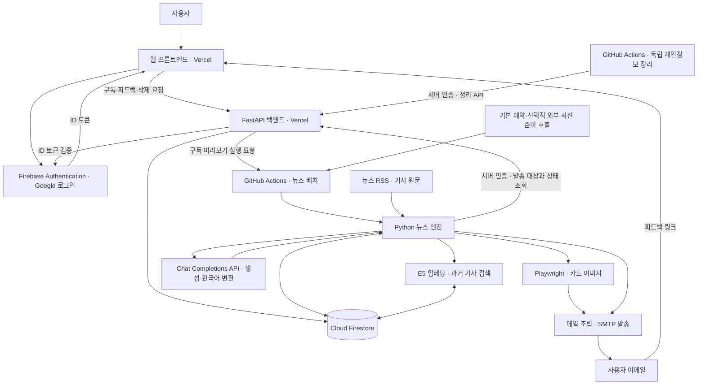

# 요구사항 정의서

## 1. 개요

| 항목 | 내용 |
|---|---|
| 프로젝트명 | AI 기반 개인화 뉴스 브리핑 |
| 문서 버전 | 1.2 |
| 작성·수정일 | 2026-10-10 |
| 대상 사용자 | 자신이 원하는 뉴스를 편리하게 받아보고 싶은 사람 |
| 제공 방식 | Google 계정으로 로그인한 뒤 관심 분야·키워드·수신 시간·구독 기간을 선택하고, 로그인한 계정의 이메일로 뉴스 브리핑 수신 |

### 프로젝트 목적

뉴스 수집과 전달은 노코드 도구나 직접 작성한 코드로 자동화할 수 있지만, 개인이 이를 활용하려면 도구를 선택하고 수집 경로·요약 방식·발송 일정을 구성하며 운영까지 관리해야 합니다.

이 프로젝트는 이러한 구축과 운영의 부담을 서비스가 대신 맡아, 사용자가 관심 주제를 선택하고 구독하는 것만으로 자신의 이메일에서 개인화된 뉴스 브리핑을 받아볼 수 있도록 하는 것을 목적으로 합니다. 뉴스 자동화의 기술적 진입 장벽을 낮추고, 사용자가 정보 수집보다 필요한 정보를 이해하고 활용하는 데 집중할 수 있도록 합니다.

### 서비스 범위

- Google 로그인과 개인정보 동의를 통한 구독 시작
- 관심 분야·키워드·수신 시간·구독 기간에 따른 개인화
- RSS 기사 수집, 기사 선별, AI 핵심 카드와 RAG 기반 배경 카드 생성
- 이메일 발송, 구독 관리, 뉴스 피드백, 계정 삭제 요청

요구사항 ID와 우선순위는 [프로젝트 기획서](docs/02_프로젝트_기획서_개인화_뉴스_브리핑.md)의 8·9절과 통일합니다. 기능 설명은 현재 구현과 처리 기준을 반영하며, 요구사항의 기재가 구현·외부 검증 완료를 의미하지는 않습니다. 사용자 테스트 결과와 발표 자료는 별도 제출물로 관리합니다.

## 2. 기능 요구사항

**Must**는 MVP 필수 기능, **Should**는 기획서에 정의된 대체 동작을 제공할 수 있는 개선 기능입니다. RAG는 필수 기능이며, 근거 부족·검색 실패 시 배경 카드를 생략하는 것은 해당 기능의 실패 처리입니다.

| ID | 기능명 | 요구사항 | 우선순위 |
|---|---|---|---|
| FR-01 | Google 로그인·세션 확인 | Firebase Authentication으로 Google 로그인·로그아웃을 제공하고, 인증된 계정의 이메일을 구독 수신 주소로 사용한다. 인증 취소·만료·실패를 안내한다. | Must |
| FR-02 | 개인정보 안내·동의 | 개인정보 수집·이용 안내를 제공하고, 필수 동의와 동의 버전·시각을 기록한 뒤 구독을 생성한다. | Must |
| FR-03 | 구독 생성 | 관심 분야 한 개 이상, 선택 키워드 최대 5개(정규화 후 각 1~20자·중복 제거), KST 0~23시 수신 시간, 7·14·28일 기간을 저장한다. 가입 다음 날부터의 첫 정기 발송과 마지막 날짜를 표시하고 동일 요청의 중복 생성을 막는다. 분야 설정이 비어 있으면 기본 6개를 제공하고 명시적인 설정은 지원 코드로 제한한다. | Must |
| FR-04 | 구독 조회·설정 변경 | 본인의 현재 구독·발송 예정 정보와 다음 설정을 조회한다. 활성 구독의 관심 분야·키워드·수신 시간 변경은 다음 날부터 적용하고 기간은 유지한다. 오늘 작업의 설정을 보존하고 버전 충돌을 안내한다. | Must |
| FR-05 | 웹사이트 구독 해제 | 로그인·소유권·사용자 확인 후 즉시 해제하고 새 발송을 차단한다. GET 요청이나 메일 토큰만으로 해제하지 않는다. 이미 전송된 메일은 회수하지 않는다. | Must |
| FR-06 | 만료·종료 안내·재구독 | 구독 만료 후 뉴스 발송을 중단하고 종료 안내를 처리한다. 수동 해제·삭제 요청은 종료 안내에서 제외한다. 재구독은 새 구독 ID로 생성하고 이전 구독과 분리한다. | Must |
| FR-07 | RSS 수집·본문 품질 | BBC·SBS·매일경제·경향신문 RSS를 수집 대상으로 사용한다. 본문·발행 시각·분야 조건을 검사하며 기사별 실패가 전체 수집을 중단시키지 않도록 한다. 소스·이용 조건 검증은 별도로 기록한다. | Must |
| FR-08 | 기사 저장·임베딩 | 제목·본문·발행 시각·분야·출처와 내용 버전을 저장하고 E5 384차원 임베딩·모델 버전을 관리한다. 임베딩 실패를 구분하고 재처리할 수 있도록 한다. | Must |
| FR-09 | URL 중복 방지 | 정규화 URL의 중복 저장을 막고 최근 7일의 sent·unknown 발송 이력에 포함된 기사 URL을 선별에서 제외한다. | Must |
| FR-10 | 개인화 기사 선별 | 발송 예정 시각 이전 24시간의 유효한 기사 중 관심 분야 기사를 선별한다. 키워드 일치를 우선하고 없으면 관심 분야로 대체하며 동일 조건에서 선별 순서를 재현할 수 있도록 한다. | Must |
| FR-11 | 과거 기사 RAG | 동일 분야의 유효한 과거 기사 근거를 검색하고 검색 결과·사용한 기사 ID를 기록한다. 근거와 검사 결과가 유효하면 배경 카드를 최대 1장 추가한다. 근거 부족·검색 실패 시 배경 카드를 생략한다. | Must |
| FR-12 | AI 카드 생성·검증 | 기사와 원문 근거로 핵심 카드 및 조건부 배경 카드 JSON을 생성한다. 구조·길이·원문 발췌·수치·날짜·출처를 검사한다. 핵심 카드가 검사를 통과해야 사용하며 동일 생성 작업의 호출은 최초 포함 최대 2회로 제한한다. 한국어 변환은 별도 단계로 처리한다. | Must |
| FR-13 | 구독자 간 결과 캐싱 | 구현 시 기사·근거·모델·프롬프트·스키마 버전별 검증 결과를 공유하고 개인정보를 분리한다. 미구현 시 비용 상한을 적용하며 동일 작업의 생성 결과·시도 기록은 유지한다. | Should |
| FR-14 | 카드 이미지·대체 텍스트 | 스토리·비교·타임라인 템플릿으로 이미지를 생성해 이메일에 삽입한다. 최대 입력·모바일 가독성을 확인하고 렌더링 실패·이미지 차단 시 읽을 수 있는 설명을 제공한다. | Must |
| FR-15 | 발송 작업·선점·재실행 | 구독·날짜·메일 종류별 고정 작업 ID와 트랜잭션 선점으로 동시 실행·재실행을 관리한다. sent 작업을 재발송하지 않고 기한 초과·취소·SMTP 결과 불명을 구분한다. | Must |
| FR-16 | Gmail SMTP 전송 | 개인별 조립 메일을 SMTP로 전송한다. 전송 직전 구독·삭제 요청 상태를 재확인하고 명확한 일시 실패만 최초 포함 최대 3회 시도한다. 결과 불명은 자동 재발송하지 않는다. | Must |
| FR-17 | 피드백 기록 | 유효한 메일 토큰으로 긍정·부정 평가, 사유 최대 5개, 의견 최대 500자를 저장한다. fragment 토큰을 POST로 확인하고 사용자 확정 후 제출한다. 링크 방문만으로 평가하지 않으며 만료·무효 토큰은 거부한다. | Must |
| FR-18 | 용량·개인정보 정리 | 만료·해제 후 30일 이내 삭제·익명화 정책과 보관 기한을 적용한다. 만료 피드백 토큰·보관본을 정리하고 삭제된 기사를 RAG에서 제외한다. 정리는 발송·AI·SMTP와 독립된 작업으로 실행한다. | Must |
| FR-19 | 계정 삭제 전용 화면·API | 본인 확인과 명시적 확인을 거쳐 삭제 요청·처리 상태를 제공한다. 전용 화면·API를 제공하지 않는 경우에도 FR-24의 실제 수동 접수·처리를 제공한다. | Should |
| FR-20 | 배포·실행 요약·복구 | 외부 접근 가능한 웹·API와 Actions 배치를 제공하고 실행·실패·용량·발송 상태를 확인할 수 있도록 한다. 예약 활성화 설정과 수동 실행·복구 절차를 관리한다. | Must |
| FR-21 | 사용자 테스트·개선 | 최소 5명의 실제 서비스 이용과 피드백을 수집하고 문제·수정·재확인을 기록한다. 결과는 별도 제출물로 관리하며 본 문서에는 완료를 주장하지 않는다. | Must |
| FR-22 | 동일 사건 타 보도 대조 | 확보된 다른 보도가 있을 때 대상·수치·시점 충돌을 비교하고 처리한다. 자동 대조를 확대하지 못하면 확보된 복수 기사 표본을 검수한다. | Should |
| FR-23 | 의미 기반 사건 묶기·반복 억제 | 구현 시 표본 평가와 보조 단서로 사건 반복을 억제한다. 비활성 시 FR-09의 URL 중복 방지를 유지하며 기사별 언론사 수를 1로 취급한다. | Should |
| FR-24 | 계정 삭제 요청의 실질 처리 | 전용 API 또는 실제 수동 채널로 요청을 접수하고 본인 확인·새 발송 차단·관련 데이터와 Firebase 인증 계정 정리·결과 안내를 처리한다. Google 계정 자체나 이미 받은 이메일은 삭제하지 않는다. | Must |
| FR-25 | 메일 본문·개인별 조립 | 뉴스·뉴스 없음·종료 안내를 개인별 HTML·텍스트 메일로 조립한다. 원문 출처·AI 표시·대체 설명·피드백 및 구독 관리 링크를 제공하고 다른 수신자의 정보가 섞이지 않도록 한다. | Must |
| FR-26 | 구독 직후 미리보기 | 최초 설정과 미리보기 요청을 구독과 함께 저장한다. 서버 GitHub 토큰이 설정되면 해당 구독만 dispatch하고 웹에 요청 상태를 안내한다. 호출 실패 시 구독을 유지하고 24시간 내 배치 복구·중복 방지를 제공한다. 정기 시작일·기간은 유지하며 요청 수락과 실제 수신을 구분한다. | Must |

## 3. 비기능 요구사항

ID와 우선순위는 기획서와 동일합니다. 입력·오류·재시도 안내는 기존 성능·응답 경험(NFR-02)을 구체화한 기준입니다.

| ID | 항목 | 요구사항 | 우선순위 |
|---|---|---|---|
| NFR-01 | 발송 신뢰성 | 고정 작업 ID·트랜잭션·선점 토큰으로 동시 실행과 재실행을 관리한다. sent 재발송을 막고 SMTP 결과 불명인 unknown 상태를 자동 재전송하지 않는다. | Must |
| NFR-02 | 성능·응답 경험 — 입력·오류·재시도 안내 | 배치 45분·수집 15분 예산과 지연 정책을 적용한다. 요청 처리 중 중복 제출을 제한하고 인증 오류·설정 충돌·저장 실패를 안내한다. 일시 오류 시 입력 상태를 유지하고 재시도를 제공한다. | Must |
| NFR-03 | 사용자 접근 통제 | 구독·계정 API는 Firebase ID 토큰과 소유권을, 피드백 API는 전용 링크 토큰을, 엔진 API는 서버 Bearer 토큰을 검증한다. 서버 IAM과 클라이언트 Firestore Security Rules로 접근 범위를 제한한다. | Must |
| NFR-04 | 개인정보·비밀값 | 서비스 계정 키·Chat API 키·SMTP 인증 정보·서버 토큰은 서버 환경변수·Secrets로 관리하고 프론트·Git·로그에 노출하지 않는다. 피드백 토큰은 fragment에서 읽은 후 주소에서 제거하고 POST body·오류 로그도 마스킹한다. 만료·해제 후 30일 이내 개인정보 정리와 명시적 계정 삭제 요청 처리를 구분한다. | Must |
| NFR-05 | 비용·재시도 제한 | 동일 생성 작업의 호출은 최초 포함 최대 2회, 명확한 일시 SMTP 실패는 최초 포함 최대 3회로 제한하며 재실행에서도 횟수를 유지한다. 한국어 변환은 별도 단계로 관리하고 실제 API 기반 비용 상한은 별도 확정한다. | Must |
| NFR-06 | 운영 가시성 | 생성·검색·발송 상태와 최근 완료·수집·실패·unknown·용량·처리 시간을 확인할 수 있도록 한다. 공개 로그는 집계 중심으로 출력하고 민감정보를 제외한다. | Must |
| NFR-07 | 이메일·이미지 가독성 | 최대 길이·모바일에서 잘림과 겹침 없이 내용을 읽을 수 있도록 한다. 렌더링 실패·이미지 차단 시 검증된 텍스트 설명을 제공한다. | Must |
| NFR-08 | AI 근거·표시 | AI 생성임을 알리고 원문 링크·근거 기사 ID와 현재·과거 시점을 구분한다. JSON 구조·발췌·수치·날짜·출처를 검사한다. 근거 부족 시 배경 카드를 생략하고 수집 장애는 뉴스 없음과 구분한다. 원문 사실성·번역 의미 일치를 완전히 판별한다고 주장하지 않는다. | Must |
| NFR-09 | 재현·인수인계 | 고정 의존성, 실행 방법, 샘플, DB·인덱스 변경 순서, 복구 절차를 문서화해 환경을 재현하고 인수인계할 수 있도록 한다. | Must |
| NFR-10 | 웹 응답 측정 목표 | 합의 전 목표: 활성 API의 비AI CRUD 30회에서 서버 처리 p95 3초 이내. 콜드 스타트는 별도 측정한다. 이는 측정 완료 결과나 보장 수치가 아니다. | Should |

## 4. AI 활용 명세

| 기능 | AI 활용 방식 | 상세 설명 |
|---|---|---|
| 핵심 카드 생성 | LLM / Chat Completions | 선택한 기사와 출처 정보를 프롬프트에 포함해 원문 발췌 방식의 카드 JSON을 생성하고, 카드 구조와 근거 표현을 검사한다. |
| 과거 기사 검색 | E5 임베딩 + Firestore 벡터 검색 | 기사 제목·본문을 384차원 벡터로 저장한다. 동일 분야의 유효한 과거 기사 중 코사인 거리로 최대 5개를 검색하고, 기본 유사도 0.85 이상인 근거를 최대 3개 사용한다. |
| 배경 카드 생성 | RAG + LLM | 검색된 과거 기사 근거를 생성 입력에 포함하고, 생성된 배경 카드가 검사를 통과한 경우 사용한다. 유효한 과거 근거가 없거나 배경 카드 검사에 실패하면 생략한다. |
| 한국어 변환 | LLM 번역 | 영문으로 생성된 카드 내용을 별도 한국어 변환 단계에서 처리한다. |
| 개인화 기사 선택 | 설정·이력 기반 선별 로직 | 저장된 관심 분야·키워드와 발송 이력으로 기사를 선택한다. 사용자 피드백은 별도로 저장한다. |

## 5. 핵심 처리 기준

| 항목 | 처리 기준 |
|---|---|
| 구독 수신 주소 | Google 로그인 계정의 이메일 |
| 첫 정기 발송 | 구독 생성 다음 날부터, 선택한 한국 시간의 발송 대상으로 처리 |
| 설정 변경 | 다음 날부터 적용; 변경 시 구독 기간은 기존 기간 유지 |
| 기사 선택 범위 | 발송 예정 시각 이전 24시간, 관심 분야 및 유효한 본문·출처 기준 |
| 카드 구성 | 검사에 통과한 핵심 카드 1장, 과거 근거를 사용하고 검사에 통과한 배경 카드 최대 1장 추가 |
| 메일 도착 시각 | 선택한 시각을 발송 기준으로 사용하며, 배치 처리와 메일 전달 과정에서 지연될 수 있음 |
| 시간 기준 | 사용자 날짜·설정 적용일·수신 시간은 KST로 계산하고 서버 시각은 시간대를 포함한 값으로 관리 |
| 구독 해제 | 이후 신규 발송 중단; 이미 전송된 메일은 회수하지 않음 |
| 계정 삭제 | 사용자·구독·피드백·발송 기록 및 관련 메일 보관본·RAG 기록과 Firebase 인증 계정을 정리하며, Google 계정 자체나 이미 받은 이메일은 삭제하지 않음 |

## 6. 시스템 아키텍처

| 구성요소 | 책임 |
|---|---|
| 웹 프론트엔드 | 로그인, 동의·구독 설정, 관리·삭제 요청, 피드백 입력과 상태 안내 |
| Firebase Authentication | Google 로그인과 사용자 인증, 삭제 요청에 따른 인증 계정 정리 |
| FastAPI 백엔드 | ID 토큰·소유권 검증, 구독·피드백·삭제 API, 엔진 전용 API, 미리보기 dispatch |
| Cloud Firestore | 사용자·구독·기사·벡터·근거·발송 상태·피드백 저장과 트랜잭션 선점 |
| Actions·Python 엔진 | 기사 수집·선별, RAG, AI 호출·검사, 이미지 연결, 메일 조립·전송·복구 |
| Chat API·E5·Playwright | 근거 기반 생성·한국어 변환, 384차원 검색 벡터, 고정 템플릿 이미지 렌더링 |
| 독립 개인정보 정리 | 발송·AI·SMTP와 별도로 Backend 정리 API를 호출해 보관 기한·삭제 요청 처리 |

브라우저는 구독·피드백 데이터를 Backend API로 처리하며 Firestore에 직접 쓰지 않습니다. 구독·계정 요청은 Firebase ID 토큰, 피드백 요청은 전용 링크 토큰, 엔진·정리 요청은 서버용 Bearer 토큰으로 검증합니다. 서버 SDK는 Firestore Security Rules를 우회하므로 API 소유권 검사와 서버 IAM 권한을 함께 적용합니다.

정기 발송의 기본/복구 예약은 매시간 7분, 독립 개인정보 정리는 매시간 17분이며 각각 활성화 설정이 필요합니다. 선택적 외부 예약은 정각 전에 환경 준비·수집을 시작하고 목표 시각 이후 생성·발송을 진행합니다. 미리보기는 구독 저장 후 해당 구독의 별도 작업으로 요청하며 정기 시작일을 앞당기지 않습니다. 예약 요청 수락·SMTP 수락·실제 수신은 구분합니다.

## 7. 관련 자료

- [프로젝트 기획서](docs/02_프로젝트_기획서_개인화_뉴스_브리핑.md)
- [프로젝트 소개 및 실행 방법](README.md)
- [배포 서비스](https://ai-news-card-frontend.vercel.app)
- [백엔드 API 문서](https://ai-news-card-nine.vercel.app/docs)
