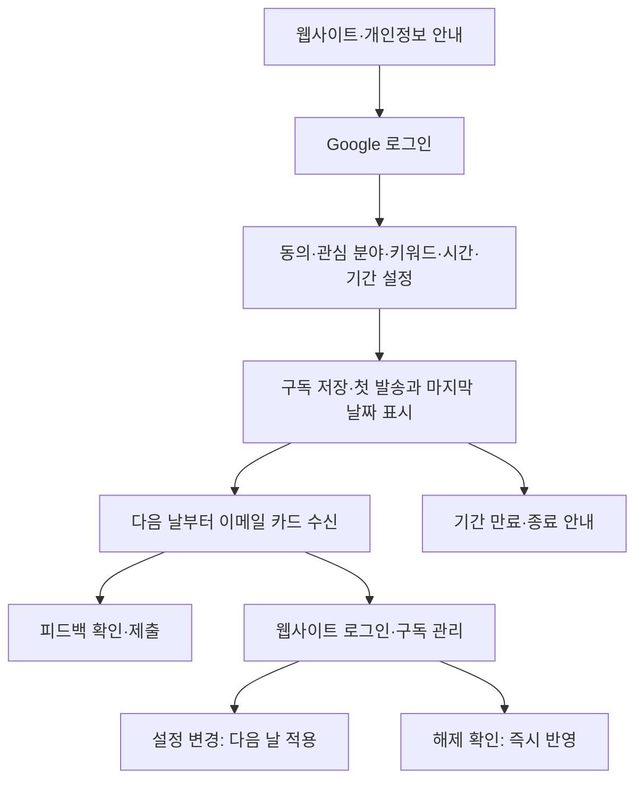
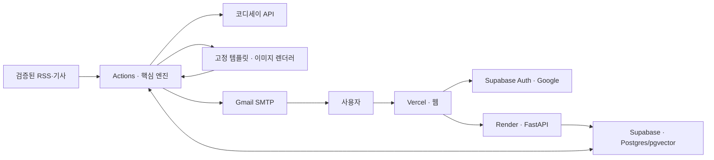
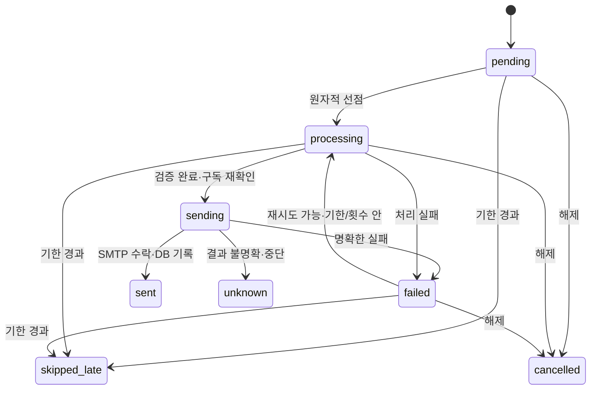

# 공통 PRD — 한눈에 읽는 개인화 뉴스 브리핑

- Version: 0.3
- 작성·수정일: 2026-10-04 (KST)
- 문서 담당: 박경연 — 리드
- 단계: 공통 정책 정리 완료 / 연결 규격·측정 목표는 팀 합의 전 초안
- 대상: 리드·핵심 엔진, Backend·DB, Frontend, 배포·QA·데이터 검증
- 기반: 시나리오 v1.6 및 2026-10-04 확정 역할 분담

> 본 문서는 팀 개발의 공통 기준이다. 실제 서비스·외부 계정·API가 검증되었다는 뜻은 아니다. 확정 정책, 제안된 연결 규격, 실제 검증 결과를 구분한다.

## 0. 문서 안내

### 0-1. 우선순위와 상태

1. 팀장과 팀이 합의한 최신 결정이 우선한다. 이 문서에서 별도 표시 없는 ‘사용자’는 서비스 이용자를 뜻한다.
2. 이 PRD의 **확정 항목**은 시나리오 v1.6의 동일 항목보다 우선한다.
3. PRD의 초안은 기존 확정 정책을 덮어쓰지 않는다. 아직 정의되지 않은 규격의 제안으로 사용한다.
4. 담당별 명세는 공통 정책·연결 규격을 임의 변경하지 않는다. 충돌은 리드와 관련 담당자가 합의하고 변경 이력에 남긴다.

| 구분 | 표기 | 의미 |
|---|---|---|
| 합의 상태 | 확정 | 팀장 또는 팀이 합의한 정책, 구현 기준 |
| 합의 상태 | 초안(합의 전) | 본 문서에서 제안하는 규격·목표, 관련 담당자 확인 필요 |
| 검증 상태 | 검증 필요 | 외부 연결·실행·품질을 확인하지 않았음 |
| 검증 상태 | 검증 완료 | 확인 날짜·환경·증거가 기록된 경우에만 사용 |
| 검증 상태 | 해당 없음 | 외부 검증과 무관한 문서·소유권 결정 |

합의와 검증은 별개다. 예를 들어 Gmail SMTP 사용은 설계상 확정이어도 실제 계정 연결은 검증 필요다. 이 PRD는 검증 완료 증거를 새로 주장하지 않는다.

### 0-2. 문서 체계

| 문서 | 작성 담당 | 범위 |
|---|---|---|
| 공통 PRD — 본 문서 | 리드 초안·전원 검토 | 사용자 가치, 범위, 공통 정책, 요구사항, 연결 계약, 출시 기준 |
| 핵심 엔진 명세 — 후속 작성 | 리드 | 수집·선별·RAG·생성·검증·렌더링·발송, SQL 선점·상태 전이 |
| Backend·DB 명세 — 후속 작성 | Backend | DB·마이그레이션·RLS·API·구독·개인정보 처리 |
| Frontend 명세 — 후속 작성 | Frontend | 화면·로그인·입력·API 연동·카드 템플릿 |
| 배포·QA 명세 — 후속 작성 | 배포·QA | 환경·권한·배포·복구·데이터 검증·통합/사용자 테스트 |
| 별도 마일스톤 계획 | 리드 취합·전원 합의 | 첫 통합·공개 테스트·종료·평가의 목표일·완료 기준; 세부 일정은 팀 관리 |

각 담당별 명세의 공통 양식: **관련 FR/NFR → 입력 → 처리 → 출력 → 실패 동작 → 완료 기준 → 의존 규격·협업 대상 → 검증 방법**.

### 0-3. 연결 계약과 변경 절차

- 규격별 소유자를 10절에 지정한다. 소유자가 변경안을 작성하고 사용하는 담당자가 호환성을 확인한다.
- 리드가 공통 정책·범위 영향을 확인한 뒤 반영한다. 공유 샘플·명세·검증 항목도 함께 갱신한다.
- 규격에는 버전을 둔다. 필드 삭제·타입 변경·의미 변경은 기존 사용처가 확인되기 전 배포하지 않는다.
- 공통 값은 4절에서 관리한다. 변경 시 담당 명세·실제 설정·테스트를 함께 갱신한다. 문서만 바꾸고 코드 설정을 방치하지 않는다.

### 0-4. 변경 이력

| 버전 | 날짜 | 내용 |
|---|---|---|
| v0.1 | 2026-10-04 | 팀장이 제시한 공통 PRD 구성안 |
| v0.2 | 2026-10-04 | 구독 기간 1·2·4주 유지, FR/NFR 고정 번호, 문서 우선순위·합의/검증 분리, 연결 계약·완료 기준·역할·운영 종료 계획 보강 |
| v0.2 수정 | 2026-10-04 | 일정표·날짜별 마일스톤·재점검 목표일 제거. 작업 일정은 팀이 별도로 조율하며 구독·운영 정책은 유지 |
| v0.3 | 2026-10-04 | 별도 마일스톤 문서 연결, 메일 본문·조립 규격 10-6 추가, fragment·POST 피드백, Must/Should 분리, API 경로·시점·문자 길이·팀원 정보·과정 종료 후 API 유효성 보강 |

---

## 1. 프로젝트 개요

### 1-1. 정의·문제·타겟 — 확정

**원하는 관심 분야의 뉴스를, 자극적이거나 오해를 유도하는 썸네일 대신 원문 근거를 확인한 카드 이미지로 빠르고 정확하게 설명하는 이메일 구독 서비스.**

- 타겟: 원하는 분야의 뉴스를 짧고 명확하게 확인하려는 사용자. 배경지식이 부족한 대학생만으로 한정하지 않는다.
- 문제: 관심 뉴스 탐색에 드는 시간, 제목·썸네일과 본문 사이의 차이, 핵심·배경 파악의 번거로움.
- 가치: 뉴스 한 건을 최대 2장의 카드로 읽고 원문·참고 출처를 확인한다.
- 정확성 범위: 원문 근거·수치·시점을 검사하고 가능한 경우 다른 보도와 대조한다. 모든 거짓뉴스 판별이나 원문의 사실성을 완전히 보장하는 서비스라고 설명하지 않는다.

상세 배경은 시나리오 1절을 참조한다.

### 1-2. 필수 기술 요소 — 확정

| 요소 | 구현 | 제출·시연 증거 |
|---|---|---|
| RAG | 과거 기사 검색 → 관련 근거 선별 → 카드 2 생성 | 검색 기사 ID·점수·근거 연결·카드 결과, 별도 RAG 평가 표본 |
| 자동화 워크플로우 | 수집 → 저장 → 선별 → 생성·검증 → 이미지·메일 발송 | Actions 기록, 발송 상태, 지연·재실행·실패 테스트 |

### 1-3. 성공 지표

| 항목 | 기준 | 상태 |
|---|---|---|
| 실제 사용자 | 외부 배포 서비스를 최소 5명이 사용하고 피드백 수집 | 확정·과제 요건 |
| 개선 반영 | 주요 피드백의 변경 내용과 재확인 결과 기록 | 확정 |
| RAG 사용 증거 | 실제 과거 근거를 사용한 카드 2 사례 제시 | 확정 |
| 제품 평가 | 관심 적합성·읽는 시간·이해도·배경 유용성·정확성·계속 사용 의향 측정 | 확정·측정 항목 |
| 만족 목표 | 적합성·이해도 5점 척도 결과와 개별 문제 사례 보고; 합격 수치는 첫 내부 테스트 후 정함 | 초안(합의 전) |

테스터 수가 작으므로 결과를 전체 사용자에 일반화하지 않는다. 피드백 링크 클릭이나 로그인만으로 실제 서비스 사용·피드백 수집을 완료했다고 보지 않는다.

## 2. MVP 범위

### 포함 — 확정

- Google 로그인, 개인정보 안내·뉴스 수신 동의
- 관심 분야·키워드·시간대·구독 기간 1주/2주/4주 선택
- 다음 날부터 발송, 다음 날 적용 설정 변경, 웹 로그인 후 해제, 만료·종료 안내
- 기사 수집·본문 품질·임베딩·선별·RAG·카드 생성·근거/수치 검사, URL 중복 방지
- 고정 템플릿의 카드 이미지, 이미지 미표시 시 읽을 수 있는 대체 설명
- 상태 기반 발송·제한된 재시도·중복 방지·피드백·개인정보 정리·본인 확인 가능한 계정 삭제 요청 처리
- 배포·운영 확인·사용자 5명 이상 테스트·개선·문서·발표

### 보류 — 확정

- 생성형 이미지 모델로 카드 전체를 그리기, 음성·채팅·다중 Agent
- 의미 기반 키워드 확장, 장기 추천 학습, 완전한 사건·후속 보도 판별
- 중간 구독 기간 연장, 자유 입력 구독 일수·종료 날짜
- 정각 수신·수신함 도착·SMTP 정확히 한 번 발송의 완전한 보장

### Should 개선과 축소 시 대체 — 확정

- 의미 기반 사건 묶기·다른 URL 반복 보도 억제(FR-23): 미구현이면 URL 중복만 막고 언론사 수는 기사별 1로 취급, 최신순 등으로 선별한다.
- 구독자 간 결과 캐싱(FR-13): 미구현이면 사용자별 생성 횟수·실행 비용 상한을 지킨다. 같은 발송 작업의 재실행에 필요한 결과·시도 기록은 Must로 유지한다.
- 계정 삭제 전용 화면/API(FR-19): 미구현이면 웹 개인정보 안내에 실제 요청 채널을 제공하고 Backend가 본인 확인·삭제·결과 안내를 수동 처리한다(FR-24 Must). 자동 30일 정리가 즉시 삭제 요청의 대체는 아니다.
- 동일 사건 타 보도 대조(FR-22): 확보된 복수 기사 표본을 먼저 검수하고 자동 대조 확대는 Should로 둔다.

### 분야 공개 조건 — 확정 / 검증 필요

목표 카테고리는 경제·IT/과학·정치·사회·국제·문화다. **실제 소스·게시 시각·본문 추출·이용 조건을 확인한 분야만** 선택 가능하게 공개한다. 분야별 서로 다른 언론사 2곳을 목표로 하며, 1곳으로 공개할 경우 관점·선정 범위의 한계를 표시하고 리드가 범위 결정을 기록한다. 검증되지 않은 분야를 가입 가능한 상태로 두지 않는다.

## 3. 사용자 흐름과 화면

### 3-1. 흐름 — 확정



메일에는 해제 링크·버튼·해제 토큰이 없다. 구독 관리 링크는 웹사이트로 이동만 한다. 웹사이트에서 로그인·본인 확인·해제 확정을 거쳐 처리한다. 이미 SMTP로 전송된 메일은 회수하지 못한다.

### 3-2. 화면 목록

| 화면/상태 | 내용 | 구현 담당 | API·검증 협업 |
|---|---|---|---|
| 랜딩·개인정보 안내 | 가치·지연 안내·수집 안내·로그인 | Frontend | Backend 문구, 리드 검토 |
| 로그인 복귀 | 세션 확인·취소·실패·재시도 | Frontend | Backend 토큰 검증, 배포 URL |
| 동의·초기 설정 | 관심·키워드·시간·1/2/4주 | Frontend | Backend 검증·저장 |
| 구독 관리 | 현재/다음 설정·첫 발송·마지막 날짜·변경·해제·재구독 | Frontend | Backend 구독 정책 |
| 피드백 확인 | 토큰 유효성·평가 확정·의견 | Frontend | Backend 토큰·저장 |
| 계정 삭제 요청 | 전용 화면은 Should; 미구현 시 개인정보 안내의 실제 요청 채널·본인 확인 절차로 대체 | Frontend | Backend 삭제 처리 |
| 공통 오류 | 입력·인증·저장·네트워크·권한 오류 | Frontend | Backend 오류 코드, QA |

화면 수가 곧 URL 수일 필요는 없다. 구독 관리·초기 설정은 구현 편의에 따라 같은 화면의 상태로 구성할 수 있다.

## 4. 공통 정책과 값 관리

### 4-1. 사용자 정책 — 확정

- DB 시각은 timezone-aware UTC, 사용자 날짜·일일 발송은 `Asia/Seoul`.
- 첫 발송은 가입 다음 KST 날짜의 선택 시간대부터다.
- **구독 기간은 1주·2주·4주 = 7·14·28일 중 선택.** 테스트에서도 세 선택지를 제공한다.
- 시작 날짜를 포함해 N일이 대상이며, `end_date_exclusive = start_date + N일`. 마지막 날짜는 `end_date_exclusive - 1일`, 종료 날짜 00:00부터 비활성.
- 기간은 성공 발송 횟수가 아니라 달력 날짜 기준이며 실패·기사 없음으로 자동 연장하지 않는다.
- 관심·키워드·시간 변경은 다음 KST 날짜부터 적용한다. 가입 때 정한 기간은 중간 연장하지 않는다.
- 키워드는 우선순위, 여러 개는 OR. 없거나 매칭이 없으면 관심 분야로 대체한다.
- 같은 URL 7일 내 재발송 금지. 사건 반복 억제는 표본 검증한 근사 규칙이며 새 전개를 무조건 차단하지 않는다.
- 카드 2는 적합한 과거 근거가 없거나 검증에 실패하면 생략한다.
- 정상 수집 후 후보 없음은 하루 1회 안내, 수집·생성 장애와 구분한다.
- 해제는 웹 로그인 후 즉시 반영, 발송 직전 다시 확인. 수동 해제에 종료 안내를 보내지 않는다.

가입 다음 날부터 선택한 기간만큼 발송하고, 마지막 구독 날짜 다음 날 00:00에 만료된다. 가입 시각·시간대와 무관하게 날짜 정책은 동일하다.

### 4-2. 공통 값 표

아래 확정값 중 `초기 운영값`은 최적 성능이 입증된 값이 아니다. 구현·테스트의 시작값이며 합의 후 조정한다. 구체적인 예외는 시나리오 4~6절 참조.

| ID | 항목 | 값 | 합의 상태 | 검증·성격 |
|---|---|---|---|---|
| P-01 | 기간 | 7 / 14 / 28일 | 확정 | 팀장 결정 |
| P-02 | 관심 분야 | 공개 분야 중 1개 이상, 목표 최대 6개 | 확정 | 분야별 검증 필요 |
| P-03 | 키워드 | 정규화 후 0~5개, 각 1~20자 | 확정 | 입력 검증 필요 |
| P-04 | 수신 시간 | KST 00~23시, 1시간 단위 | 확정 | 정각 보장 없음 |
| P-05 | 배치 예약 | 매시간 7분, UTC cron `7 * * * *` | 확정 | 초기 운영값·실행 검증 필요 |
| P-06 | 배치/수집 예산 | 전체 45분 / 수집 15분 | 확정 | 초기 운영값 |
| P-07 | 뉴스 지연 기한 | 예정 시각부터 3시간, 날짜 경과·해제·만료 시 종료 | 확정 | 초기 운영값 |
| P-08 | 종료 안내 기한 | 만료부터 24시간 | 확정 | 초기 운영값 |
| P-09 | 선별 후보 | 예정 시각 이전 최근 24시간 | 확정 | 기사 게시 시각 기준 |
| P-10 | 반복 방지 이력 | 최근 7일, sent·unknown 포함 | 확정 | 최근 자료 보존 |
| P-11 | RAG | 작업 날짜 KST 00:00 이전, 검색 최대 5개·사용 최대 3개 | 확정 | 관련성 기준 튜닝 필요 |
| P-12 | 카드 수·길이 | 최대 2장; 제목 60자; 카드별 설명 400자; 용어 최대 2개·각 풀이 100자 | 확정 | 초기 운영값·최대 입력 검증 필요 |
| P-13 | 생성 호출 | 생성 작업별 최초 포함 최대 2회, 일시 오류 재호출 포함 | 확정 | 캐싱 유무와 무관하게 횟수 영속 저장 |
| P-14 | LLM 요청 제한 | 초기 60초 | 확정 | 실제 API로 검증 필요 |
| P-15 | SMTP 시도 | 명확한 일시 실패만 최초 포함 최대 3회 | 확정 | unknown 자동 재시도 금지 |
| P-16 | 이미지 재시도 | 최초 + 1회, 실패 시 검증된 텍스트 대체 | 확정 | 렌더러 검증 필요 |
| P-17 | 피드백 유효기간 | 브리핑 예정 날짜부터 30일 | 확정 | 삭제 정책과 함께 적용 |
| P-18 | 개인정보 정리 | 만료·해제 후 30일 이내 삭제/익명화 | 확정 | 처리·보관 범위 실제 확인 |
| P-19 | DB 경고/정리 | 한도 500MB 환경에서 350MB 경고 / 400MB 정리 | 확정 | 계정 한도 확인·초기 운영값 |
| P-20 | 운영 점검 | 하루 1회, 마지막 완료 2시간 이상 미확인 시 확인 대상 | 확정 | 초기 운영값 |
| P-21 | 문자 길이 계산 | NFKC 후 Unicode code point 수; JS는 `[...str.normalize('NFKC')].length`, Python은 `len(unicodedata.normalize('NFKC', str))`; 공백·문장부호 포함 | 초안(합의 전) | JS의 str.length 사용 금지, 이모지 포함 공통 샘플 검증 |
| P-22 | HTTP·본문·렌더 제한, 기사 수·메일 용량·비용 상한 | 실제 표본·API 한도 확인 후 담당 명세에서 값 제안 | 초안(합의 전) | 공개 테스트 전 확정 필요 |

발송 가능 구간은 `scheduled_at <= now < deadline_at`. 뉴스 deadline은 예정 시각+3시간, 다음 KST 자정, 구독 만료 중 가장 이른 시각이다. 기한·날짜 경과는 skipped_late, 사용자 해제는 cancelled로 구분한다.

## 5. 시스템 아키텍처

### 5-1. 구성



### 5-2. 배치 단계

`환경·실행 확인 → 용량 확인 → 수집·본문·임베딩 → 작업 생성/복구·선점 → 기사 선별 → RAG → 캐시/AI 생성·검증 → 이미지 → 구독 재확인·SMTP → 상태 저장 → 일일 정리·실행 요약`

- 수집 일부 실패로 기존 정상 후보의 발송까지 막지 않는다.
- 리드가 메일 HTML·텍스트 본문과 개인별 조립 코드를 소유한다. Frontend의 카드 이미지 템플릿과 구분하며 뉴스·뉴스 없음·종료 안내 모두 10-6 규격을 사용한다.
- 개인정보 정리 로직은 Backend가 작성하며 리드가 배치에 호출 연결한다. 실행 환경·운영 확인은 배포·QA.
- SQL·테이블별 상세 구조는 담당 명세에 둔다. 발송 관련 DB 코드는 리드가 소유하고 Backend가 전체 마이그레이션에 통합한다.

### 5-3. 컴포넌트 소유권

| 컴포넌트 | 책임자 | 협업 |
|---|---|---|
| 기사·임베딩·RAG·생성·발송 엔진 | 리드 | QA 데이터 표본 |
| 메일 HTML·텍스트·개인별 조립 | 리드 | Backend 피드백 토큰, Frontend 카드 템플릿, QA 메일 검증 |
| 발송 작업 테이블·선점·유일성·전이 | 리드 | Backend 리뷰·마이그레이션 |
| 사용자·구독·피드백 API·DB·삭제 | Backend | Frontend·리드 |
| 웹·OAuth 콘솔·카드 템플릿 | Frontend | Backend·배포 |
| 실행 환경·Secrets·배포·통합 검증 | 배포·QA | 전원 |

## 6. AI 활용 설계

### RAG — 확정 방식 / 검증 필요

- 기사별 검색 벡터 1개, `multilingual-e5-small` 384차원, 정규화·cosine similarity.
- 저장은 `passage:`, 질의는 `query:`. 제목과 본문 앞부분을 512토큰 이내로 구성한다.
- 게시 시각·본문·벡터가 유효한 과거 기사만 검색한다. 제목·URL만 남은 기사는 제외한다.
- 검색 점수는 사실 확률이 아니다. 사건 동일성과 배경 유용성은 별도 라벨·기준으로 평가한다.
- 사건 묶기는 검색 벡터를 이용한 근사 규칙이다. 실패하면 URL 중복 방지만 유지하고 한계를 문서에 기록한다.

### 생성·검증 — 확정 방식 / 검증 필요

- 구조화된 JSON, 설명 문장별 허용 기사 ID와 근거 구절. 상세 프롬프트는 엔진 명세에서 관리한다.
- 카드 1은 오늘 기사, 카드 2는 오늘·선별된 과거 기사만 근거로 사용한다.
- 숫자·단위·대상·시점을 대조한다. 없는 계산값·예측은 넣지 않는다. 숫자 일치만으로 사실 검증 완료라고 주장하지 않는다.
- 기사 내부 지시는 외부 데이터로 취급하며 시스템 명령으로 따르지 않는다.
- 구독자 간 캐시는 Should다. 구현 시 기사/근거 내용 버전·모델·프롬프트·출력 스키마별로 관리하고 검증된 결과만 재사용한다.
- 이미지 캐시를 구현하면 템플릿·폰트·렌더러 버전도 포함한다. 개인별 토큰·선택 이유를 공통 이미지에 넣지 않는다.
- 캐시를 생략해도 같은 작업의 검증 결과·이미지 참조·호출 횟수는 재실행을 위해 저장한다. 캐싱 미구현을 이유로 호출 한도나 발송 안전성을 생략하지 않는다.
- AI 출력 이미지 직접 생성이 아니라 검증된 텍스트를 고정 디자인에 렌더링한다.

## 7. 기술 선택과 외부 검증

### 7-1. 선택·대안·근거

| 영역 | 선택 | 고려 가능한 대안 | 선택 이유·제약 | 상태 |
|---|---|---|---|---|
| 웹 | 바닐라 HTML/CSS/JS + Vercel | React 등 | 소규모 화면·기존 경험, 실제 배포·정책 확인 | 선택 확정/검증 필요 |
| API | FastAPI + Render | 다른 Python 호스팅 | 설정·권한·피드백 API, 무료 콜드 스타트·SMTP 제한 확인 | 선택 확정/검증 필요 |
| 인증 | Supabase Auth + Google | 이메일 인증 | 로그인과 DB 연계, 실제 scope·콜백 검증 | 선택 확정/검증 필요 |
| DB | Supabase Postgres + pgvector | 별도 DB+벡터 DB | 관계형 데이터·검색·선점을 한곳에서 관리, 용량·연결 제약 | 선택 확정/검증 필요 |
| 자동화 | Actions + Python | 전용 스케줄러 | 배치 서버 분리, 예약 지연·누락과 한도 확인 | 선택 확정/검증 필요 |
| 메일 | Gmail SMTP | 메일 전용 서비스 | 초기 계정 기반 발송, 앱 비밀번호·제한·전달 문제 확인 | 선택 확정/검증 필요 |
| LLM | 코디세이 API 지원 모델 | 접근 가능한 다른 모델 | 실제 모델·호환성·비용 확인 후 확정; 기존 후보명 제공 여부 미확정 | 검증 필요 |
| 임베딩 | multilingual-e5-small | API 임베딩·다른 로컬 모델 | 한국어 검색·로컬 CPU, 모델·의존성 캐시와 품질 확인 | 선택 확정/검증 필요 |
| 추출 | feedparser + trafilatura | 소스별 추출기 | 공개 피드와 본문 처리, 추출 성공·품질 보장 없음 | 선택 확정/검증 필요 |
| 이미지 | HTML/CSS + Playwright/Chromium | 다른 결정적 렌더러 | 텍스트 정확성과 디자인 통제, 폰트·메모리·첨부 크기 확인 | 선택 확정/검증 필요 |

현재 무료 한도·기능을 검증 완료로 간주하지 않는다. 계정 화면·공식 문서·실행 결과를 배포·QA가 기록한다. 외부 서비스 제약 상세는 시나리오 8절, 공식 링크는 부록 참조.

### 7-2. 검증 체크리스트

| 확인 대상 | 담당 | 필요한 증거 | 현재 상태 |
|---|---|---|---|
| API 모델 ID·응답·구조화 출력·크레딧·한도 | 리드 | 비밀값 없는 호출 표본·설정 | 검증 필요 |
| 코디세이 키의 과정 종료 후 유효성·잔여 크레딧·종료 정책 | 리드+배포·QA | 제공 측 안내·유효기간·운영 기간 비교, 비밀값 없이 기록 | 검증 필요 |
| Gmail 앱 비밀번호·SMTP 연결 | Backend | 테스트 메일·결과 코드 | 검증 필요 |
| Actions의 실제 SMTP·모델·렌더러 실행 | 리드+배포·QA | 배포 환경 실행 로그 | 검증 필요 |
| RSS 응답·파싱·분야·날짜·본문·이용 조건 | 배포·QA | 소스별 검증표·기사 표본 | 검증 필요 |
| Google/Supabase scope·콜백·복귀·테스터 로그인 | Frontend | 외부 URL 로그인 테스트 | 검증 필요 |
| DB 연결 방식·RLS·용량·마이그레이션 | Backend | 연결·권한 테스트 | 검증 필요 |
| 플랫폼 한도·계정 권한·Secrets 등록 권한 | 배포·QA | 권한/한도 표, 값 자체는 기록 금지 | 검증 필요 |
| 카드 이미지·CID·이미지 차단·모바일 표시 | Frontend+리드+QA | 최대 입력·실제 메일 캡처 | 검증 필요 |

## 8. 기능 요구사항 — FR

번호는 기능의 고정 ID다. 담당이 바뀌어도 변경하지 않는다. 아래 요구사항은 공통 정책에서 도출한 범위이며 실제 구현은 검증 전이다. Must는 MVP 필수, Should는 대체 동작이 있으면 공개를 막지 않는 개선, Could는 여유가 있을 때 구현한다. 분리된 기능은 새 ID를 추가하고 기존 번호를 다시 매기지 않는다.

| ID | 기능·설명 | 우선순위 | 담당 | 시나리오 | 완료 기준 |
|---|---|---|---|---|---|
| FR-01 | Google 로그인·세션 확인 | Must | Frontend/Backend | 3-1, 9-1 | 외부 URL 로그인·취소·만료 처리, 서버 JWT 검증 |
| FR-02 | 개인정보 안내·동의 | Must | Backend/Frontend | 3-1, 9-3 | 로그인 전 안내, 동의 버전·시각 저장, 미동의 구독 비활성 |
| FR-03 | 구독 생성 | Must | Backend/Frontend | 3-1, 4-1 | 관심·키워드·시간·7/14/28일 검증, 중복 저장 방지, 첫·마지막 날짜 표시 |
| FR-04 | 구독 조회·설정 변경 | Must | Backend/Frontend | 3-3, 5-6 | 현재·다음 설정 구분, 다음 날 적용, 오늘 작업 스냅샷 유지 |
| FR-05 | 웹사이트 구독 해제 | Must | Backend/Frontend | 3-3, 9-2 | 로그인·본인·확정 후 즉시 해제, GET/메일 토큰으로 해제 불가 |
| FR-06 | 만료·종료 안내·재구독 | Must | Backend/리드 | 3-3, 4 | 만료 후 뉴스 중단, 수동 해제 제외, 종료 작업 유일성·재구독 분리 |
| FR-07 | RSS 수집·본문 품질 | Must | 리드 | 5-2~3 | 검증된 소스·유효 본문/날짜만 후보, 기사 실패가 전체 중단 안 함 |
| FR-08 | 기사 저장·임베딩 | Must | 리드 | 5-4 | 내용 버전·벡터·모델 버전 저장, 실패 표식·재처리 |
| FR-09 | URL 중복 방지 | Must | 리드 | 5-3, 5-5 | 정규화 URL 중복 저장·7일 내 재발송 방지; 의미 묶기 없이도 동작 |
| FR-10 | 개인화 기사 선별 | Must | 리드 | 5-7 | 키워드 우선·관심 대체·언론사 수/최신/ID 동점 규칙 재현 |
| FR-11 | 과거 기사 RAG | Must | 리드 | 5-8 | 유효 과거 근거 검색·기록, 무근거 카드 2 생략 |
| FR-12 | AI 카드 생성·검증 | Must | 리드 | 6 | 타입·길이·근거·수치 검사, 2회 한도·카드별 실패 정책 |
| FR-13 | 구독자 간 결과 캐싱 | Should | 리드 | 5-9 | 구현 시 생성 전 조회·버전 키·개인정보 분리; 미구현 시 비용 상한·동일 작업 기록 유지 |
| FR-14 | 카드 이미지·대체 텍스트 | Must | Frontend/리드 | 5-10 | 최대 입력 가독성, 이미지 실패/차단 시 검증된 설명 제공 |
| FR-15 | 발송 작업·선점·재실행 | Must | 리드 | 4-3, 5-6 | 동일 작업 동시/재실행에서 sent 재발송 없음, 기한·unknown 처리 |
| FR-16 | Gmail SMTP 전송 | Must | 리드 | 5-10, 7 | 10-6 조립 메일 전송, 계정 실패·수락 불확실 구분 |
| FR-17 | 피드백 기록 | Must | Backend/Frontend | 3-4, 9-2 | fragment 토큰·POST 조회/확정, 자동 방문 평가 없음, 만료 거부·로그 누출 검증 |
| FR-18 | 용량·개인정보 정리 | Must | Backend/리드 | 9-3~4 | 날짜별 정리·보호 근거·RAG 제외, 30일 삭제/익명화 검증 |
| FR-19 | 계정 삭제 전용 화면·API | Should | Backend/Frontend | 9-3 | 본인 요청·상태 안내; 미구현 시 FR-24 수동 요청 채널 제공 |
| FR-20 | 배포·실행 요약·복구 | Must | 배포·QA/리드 | 10 | 외부 접근, 실행/실패/용량 확인, 수동 복구 절차 |
| FR-21 | 사용자 테스트·개선 | Must | 배포·QA/전원 | 11 | 최소 5명 실사용, 설문·문제·수정·재확인 기록 |
| FR-22 | 동일 사건 타 보도 대조 | Should | 리드/QA | 1, 5-5 | 확보된 타 보도가 있을 때 대상·수치·시점의 충돌 사례 확인·처리 기록 |
| FR-23 | 의미 기반 사건 묶기·반복 억제 | Should | 리드 | 5-5 | 표본 평가·보조 단서·7일 비교; 비활성 시 URL만 중복 방지·기사별 보도 언론사 1 |
| FR-24 | 계정 삭제 요청의 실질 처리 | Must | Backend | 9-3 | 전용 화면 또는 실제 수동 채널, 본인 확인·발송 중단·삭제·결과 안내 기록; 자동 정리와 별도 |
| FR-25 | 메일 본문·개인별 조립 | Must | 리드 | 3-2, 5-10 | 뉴스·없음·종료 본문, 출처·AI 표시·대체 설명·안전한 피드백·관리 링크; 수신자 분리 |

RAG·자동화·외부 배포·사용자 피드백·보안·발송 안전성은 일정이 부족해도 임의로 Could로 내리지 않는다. 범위 축소는 소스 확대·사건 판단 정교화 등에서 먼저 검토한다.

축소 순서 제안: FR-13 공유 캐싱 → FR-23 의미 묶기 → FR-22 자동 타 보도 대조 → FR-19 전용 삭제 화면. 각 항목의 대체 동작은 먼저 검증한다. 비용 검증상 캐싱 없이는 예산을 맞출 수 없으면 FR-13 구현을 우선하며, 기본 AI·근거 검증은 유지한다.

## 9. 비기능 요구사항 — NFR

| ID | 항목·설명 | 우선순위 | 담당 | 시나리오 | 완료 기준 |
|---|---|---|---|---|---|
| NFR-01 | 발송 신뢰성 | Must | 리드 | 4-3, 10 | 재실행·동시 실행·중단 테스트 통과, unknown 자동 재전송 없음 |
| NFR-02 | 성능·응답 경험 | Must | 전원 | 5-1, 10 | 배치 45분·수집 15분 제한, 웹 로딩·입력 유지, 지연 정책 준수 |
| NFR-03 | 사용자 접근 통제 | Must | Backend | 9-1 | 미인증·타인·만료 토큰으로 조회/변경 거부, RLS/API 검사 |
| NFR-04 | 개인정보·비밀값 | Must | Backend/Frontend/배포·QA | 9 | 토큰 쿼리 금지·POST body 마스킹·fragment 제거, 로그·저장소 키 누출 없음, 삭제 점검 |
| NFR-05 | 비용·재시도 제한 | Must | 리드 | 6-3, 10 | 재실행에서도 호출/전송 횟수 유지, 실제 API 기반 실행 상한 확정 |
| NFR-06 | 운영 가시성 | Must | 배포·QA/리드 | 10 | 최근 완료·수집·발송·failed·unknown·용량·시간 확인 가능 |
| NFR-07 | 이메일·이미지 가독성 | Must | Frontend/QA | 5-10 | 최대 입력에서 잘림/겹침 없음, 모바일·이미지 차단 대체 읽기 가능 |
| NFR-08 | AI 근거·표시 | Must | 리드/Frontend | 6, 9 | 출처 ID·원문 링크·AI 표시, 과거/현재 시점 구분·검수 기록 |
| NFR-09 | 재현·인수인계 | Must | 전원 | 12 | 고정 의존성·실행 문서·샘플·마이그레이션·복구 절차로 재현 |
| NFR-10 | 웹 응답 측정 목표 | Should | Backend/QA | 10 | 초안: 활성 API 비AI CRUD 30회, 서버 처리 p95 3초 이내; 콜드 스타트는 별도 측정 |

NFR-10의 수치·표본은 초안이며 실제 환경으로 합의한다. 가용률·정확도·수신율을 측정 없이 수치로 보장하지 않는다. SMTP sent는 서버 수락이지 수신함 도착·열람 확인이 아니다.

## 10. 연결 규격 — 초안(합의 전)

이 절의 필드·경로·구조는 개발 시작을 위한 제안이다. 기존 정책을 바꾸지 않으며 관련 담당자 확인 후 계약 버전 1.0으로 고정한다. 공통 값은 4절을 참조하고 중복 정의하지 않는다.

| 규격 | 소유자 | 확인자 |
|---|---|---|
| 구독 조회·날짜별 스냅샷 | Backend | 리드 |
| 카드 데이터 JSON | 리드 | Frontend·QA |
| 웹 API | Backend | Frontend |
| 발송 테이블·선점·상태 전이 | 리드 | Backend·QA |
| 카드 템플릿 입력·렌더링 인터페이스 | Frontend | 리드·QA |
| 개인별 메일 조립 데이터·HTML/텍스트 본문 | 리드 | Backend·QA, 카드 디자인 협업은 Frontend |

### 10-1. 구독 조회 — Backend → 엔진

인증된 엔진 전용 경로/DB 접근 기능을 사용한다. 일반 사용자가 전체 수신자 목록을 조회할 수 없다.

| 필드 | 타입·의미 |
|---|---|
| contract_version | 문자열, 계약 버전 |
| subscription_id / user_id | UUID, 구독·소유자 |
| recipient_email | 인증된 수신 주소, 로그 마스킹 |
| status | active / cancelled / expired |
| start_date / end_date_exclusive | KST 날짜, 시작 포함·종료 제외 |
| scheduled_date_kst / scheduled_at / deadline_at | 대상 날짜·UTC 예정/기한 |
| timezone | Asia/Seoul |
| settings_version / effective_date | 해당 날짜 적용 설정 버전·적용일 |
| categories / keywords / delivery_hour_kst | 정규화된 분야·키워드·시간 |

작업은 이 결과를 스냅샷으로 저장한다. 설정 수정 후 오늘 데이터가 바뀌지 않아야 한다. 해제·만료는 스냅샷보다 최신 구독 상태가 우선이며 SMTP 직전 별도 조회로 확인한다. 조회 실패는 뉴스 없음으로 처리하지 않는다.

샘플 구독 스냅샷(연결 테스트용 가상 값):

```json
{
  "contract_version": "1.0",
  "subscription_id": "00000000-0000-4000-8000-000000000001",
  "user_id": "00000000-0000-4000-8000-000000000002",
  "recipient_email": "tester@example.com",
  "status": "active",
  "start_date": "2026-10-18",
  "end_date_exclusive": "2026-11-15",
  "scheduled_date_kst": "2026-10-18",
  "scheduled_at": "2026-10-17T23:00:00Z",
  "deadline_at": "2026-10-18T02:00:00Z",
  "timezone": "Asia/Seoul",
  "settings_version": 1,
  "effective_date": "2026-10-18",
  "categories": ["economy"],
  "keywords": ["금리"],
  "delivery_hour_kst": 8
}
```

카테고리 API 코드 초안: economy / it_science / politics / society / world / culture. UI의 한국어 표시와 분리하고 공개 코드 목록은 /catalog로 제공한다.

### 10-2. 카드 JSON — 엔진 → 템플릿

공통 이미지 데이터에는 수신자·메일 토큰·개인별 선택 이유가 없다. 카드가 없는 날의 안내는 별도 메일 형식이다. `card2` 생략은 null로 통일하는 안이다.

```json
{
  "schema_version": "1.0",
  "article_id": "article_fixture_001",
  "title": "샘플 기사: 서비스 연결 테스트",
  "published_at": "2026-10-05T21:00:00Z",
  "card1": {
    "sentences": [
      {"text": "테스트용 기사에서는 시험 운영이 시작됐다고 설명합니다.", "source_article_id": "article_fixture_001", "evidence_quote": "시험 운영이 시작됐다", "as_of": "2026-10-06", "temporal_role": "current", "numbers": []}
    ],
    "terms": []
  },
  "card2": null,
  "sources": [
    {"article_id": "article_fixture_001", "publisher": "테스트 출처", "url": "https://example.com/news/fixture-001", "published_at": "2026-10-05T21:00:00Z"}
  ],
  "ai_generated": true
}
```

이는 실제 뉴스가 아닌 연결 테스트용 가상 데이터다. 근거 구절은 별도 fixture 본문에 존재해야 한다. URL을 실제 기사 검증 대상으로 쓰지 않는다.

- card1 필수, card2는 같은 문장 구조 또는 null. 용어는 카드 1에 최대 2개, 각 `term / definition / source_article_id / evidence_quote`.
- 모든 설명 문장에 `as_of`(근거상 사실의 기준 날짜 또는 null)와 `temporal_role`(current / past)을 둔다. 카드 2는 과거 문장에 날짜 표시를 요구한다. 숫자 없는 과거 문장도 동일하다.
- 과거 문장의 as_of를 근거에서 확인할 수 없으면 null로 두고 `sources[].published_at`으로 ‘YYYY-MM-DD 보도에 따르면’이라고 표시한다. 기사 게시 날짜를 사건 발생 날짜로 꾸미지 않는다. 현재/과거·근거 날짜를 구분할 수 없는 문장은 제외한다.
- 템플릿은 카드 2의 past 문장에 `as_of`가 있으면 기준일, 없으면 근거 보도일을 화면에 표시한다. 리드가 시점·근거를 검증하고 Frontend가 날짜 표시를 구현한다.
- 설명 400자는 카드별 sentences.text의 합산 길이로 계산한다. 용어 풀이의 길이는 별도로 제한하되 화면의 최대 입력 검증에는 함께 포함한다.
- 수치가 있으면 문장별 `numbers`에 `surface / unit / subject / as_of / source_article_id / evidence_quote`를 추가한다. 없으면 빈 배열. 상세 지원 타입은 엔진 명세에서 정한다.
- 템플릿은 허용 필드만 표시한다. 근거 구절 등 검수용 필드를 모두 이미지에 노출하지 않는다.
- 잘못된 타입·초과 길이·미등록 source ID는 렌더링 전에 거부한다. 제목·설명을 임의로 잘라 사실 관계를 바꾸지 않는다.
- 출처 URL은 ID로 검증된 DB에서 채운다. API가 임의 사용자 입력·LLM URL을 신뢰하지 않는다.

### 10-3. 웹 API — Backend ↔ Frontend

기본 경로 제안: `/api/v1`. Google 로그인 자체는 Supabase SDK 흐름이며 FastAPI에 Google 비밀번호를 보내지 않는다. 사용자 API는 Supabase Bearer JWT를 검증한다.

| 메서드·경로 | 인증 | 요청 | 응답·정책 |
|---|---|---|---|
| GET /catalog | 공개 | 없음 | 검증된 공개 분야, 기간 [7,14,28], 정책/동의 버전 |
| GET /subscriptions/current | JWT | 없음 | active/current_settings/next_settings·적용일·첫/마지막/종료 날짜, 없으면 null |
| POST /subscriptions | JWT | consent_version, categories, keywords, delivery_hour_kst, duration_days | 저장된 구독; 기간 7/14/28만, 중복 생성 방지 |
| PATCH /subscriptions/{id}/settings | JWT·소유권 | categories, keywords, delivery_hour_kst, expected_settings_version | 다음 날 적용 설정; 기간 변경은 거부 |
| POST /subscriptions/{id}/cancel | JWT·소유권 | confirm=true | 해제 상태·시각; 반복 요청은 같은 결과, 이전 구독 ID로 새 구독 해제 불가 |
| POST /feedback/resolve | 피드백 토큰(body) | {token} | 제출 가능 여부·기존 평가 최소 정보, 조회 전용·평가 변경 없음 |
| POST /feedback | 피드백 토큰(body) | token, rating, reasons, comment | 사용자 확정 후 저장/갱신; 만료·잘못된 토큰 거부 |
| POST /account-deletion-requests | JWT | confirm=true | Should: 전용 요청 API, 발송 중단·Backend 정리 |
| GET /account-deletion-requests/{id} | JWT·소유권 | 없음 | Should: 본인 요청 상태; Auth 삭제 후 조회 불가 안내 |

- 요청 body의 user_id·email을 신뢰하지 않는다. 실제 소유자·메일은 서버의 인증 정보로 결정한다.
- 생성 요청에는 Idempotency-Key를 사용하고 서버에서 사용자·키·payload 해시를 확인하는 안이다. 같은 키·내용은 같은 결과, 같은 키·다른 내용은 409.
- 수정은 버전 충돌 시 409 후 최신 설정 재조회. 미인증은 401, 권한은 403 또는 정보 노출을 줄이는 404 정책을 Backend가 통일한다.
- 오류 형식: `{ "error": { "code": "SETTINGS_CONFLICT", "message": "설정이 변경되었습니다. 다시 확인해 주세요.", "request_id": "..." } }`.
- 오류 코드: INVALID_INPUT(422), AUTH_REQUIRED(401), FORBIDDEN(403), NOT_FOUND(404), ACTIVE_SUBSCRIPTION_EXISTS(409), SETTINGS_CONFLICT(409), TOKEN_INVALID/TOKEN_EXPIRED(400/410), RATE_LIMITED(429), SERVICE_UNAVAILABLE(503).
- 저장 실패·네트워크 시간 초과에는 성공 화면을 보여주지 않는다. 프런트는 입력을 보존하고 같은 생성 키로 재확인한다.
- 피드백 API에 토큰을 쿼리·경로로 전달하지 않는다. HTTPS POST body만 사용하며 접근/애플리케이션/APM/오류·요청 body 로그에서 token 필드를 제외·마스킹한다. POST라서 자동으로 안전하다고 가정하지 않는다.
- 메일 링크는 `https://<web-origin>/feedback#t=<urlencoded-token>` 형태다. fragment는 HTTP 요청으로 서버에 전달되지 않는다. Frontend는 읽은 토큰을 메모리에 보관하고 즉시 `history.replaceState`로 주소에서 fragment를 제거한다. 브라우저·메일 앱·스크립트가 읽을 가능성까지 사라지는 것은 아니다. [MDN fragment 설명](https://developer.mozilla.org/en-US/docs/Web/URI/Reference/Fragment)
- 피드백 페이지에는 외부 분석/추적 스크립트·제3자 리소스를 넣지 않고 Referrer-Policy: no-referrer, API 응답 Cache-Control: no-store를 적용한다. 토큰을 localStorage·sessionStorage·브라우저 로그에 저장하지 않는다.
- 페이지 진입의 resolve POST는 토큰 유효성 조회만 한다. 평가 POST는 버튼 확정 후에만 전송한다. fragment 제거 후 새로고침으로 토큰이 없으면 메일 링크를 다시 열도록 안내한다. 링크 추적·리다이렉트가 fragment를 보존하는지도 실제 메일로 검증한다.
- 엔진 전용 규격에는 Backend가 제공하는 `get_subscription_snapshot`, `check_delivery_eligibility`, `issue_feedback_token(job_id)` 기능도 포함한다. 구현이 내부 함수인지 보호된 API인지는 Backend·리드가 합의한다. 피드백 토큰은 메일에 한 번 전달할 원문과 DB 해시를 구분하며, 일반 사용자에게 전체 발송 정보·토큰 발급 권한을 노출하지 않는다.

### 10-4. 발송 작업 — 리드 소유, Backend 리뷰

주요 필드 초안: `job_id, subscription_id, scheduled_date_kst, mail_kind, scheduled_at, deadline_at, status, settings_snapshot, selected_article_id, generation_key, smtp_attempts, retryable, next_retry_at, claim_token, claimed_at, error_code, run_id, sent_at`.

- UNIQUE(subscription_id, scheduled_date_kst, mail_kind).
- pending 또는 재시도 가능한 failed만 DB에서 원자적으로 선점한다. 소유권 없는 실행이 상태·SMTP를 변경하지 못하도록 claim_token을 조건으로 검사한다.
- 발송 유일성·선점·상태 SQL과 테스트는 리드가 작성하고 Backend가 리뷰 후 전체 마이그레이션에 반영한다.



- 상태도는 주요 전이다. sending·sent는 이미 전송됐을 수 있으므로 해제 시 되돌려 취소했다고 표시하지 않는다.
- stale processing은 SMTP 미시도 확인·기존 소유권 차단 후에만 재선점한다. 오래된 sending은 unknown, 자동 재전송 금지.
- claim timeout·heartbeat·재선점 SQL은 리드 명세에서 제안하고 QA가 중단·동시 실행으로 확인한다.
- 생성 호출 횟수는 generation_key별 별도 생성 작업에 영속 저장한다. SMTP 횟수와 혼합하거나 재실행 시 초기화하지 않는다.
- 공유 캐싱을 생략하면 generation_key에 job_id와 기사/근거/모델/프롬프트 버전을 포함해 작업별로 관리한다. 공유 캐싱을 구현하면 동일 기사 조합의 생성 작업을 공유하되 동시에 한 실행만 생성하도록 선점한다. 어느 경우에도 같은 생성 작업의 2회 한도는 재실행으로 초기화하지 않는다.
- 만료·늦은 날짜 작업은 기한에 따라 처리하며 사용자 해제와 오류 코드를 구분한다. 종료 안내는 mail_kind=subscription_end로 같은 안전장치를 사용한다.

### 10-5. 공유용 샘플·렌더링 계약

계약 합의 시 저장소 `contracts/`에 아래 샘플을 만든다. 이는 향후 위치 제안이며 현재 파일이 생성됐다는 뜻은 아니다.

| 샘플 | 작성 | 확인 |
|---|---|---|
| 구독 7/14/28일·다음 설정·해제·만료·23시 경계 | Backend | 리드·QA |
| 카드 1만·2장·수치·근거·잘못된 필드 | 리드 | Frontend·QA |
| 제목 60·카드별 설명 400·용어 2개/풀이 각 100자를 동시에 채운 입력 | 리드+Frontend | QA |
| 긴 영문·숫자·한글·이모지·출처명·줄바꿈·초과 입력 | Frontend | 리드·QA |
| 카드 2 과거 문장(as_of 유/무)·게시일과 사건일 구분 | 리드 | Frontend·QA |
| 피드백 fragment·POST 조회·확정·만료·리로드 | Backend+Frontend | 리드·QA |
| API 성공·입력 오류·만료·충돌 응답 | Backend | Frontend |

렌더링 인터페이스 초안: `render_card(card_data, template_version) → image_files + layout_result`.
Frontend는 원격 API·개인정보·토큰에 의존하지 않는 템플릿과 최대 입력 표시를 완성한다. 리드는 Actions 렌더러·파일 생성·메일 첨부를 연결한다. QA는 글자 잘림·겹침·가독성·이미지 차단·용량을 확인한다. 읽기 어려운 작은 글씨로 억지로 맞추지 않는다.

글자 수 검증은 P-21을 따른다. JS의 str.length는 UTF-16 코드 단위여서 사용하지 않는다. 예를 들어 정규화된 `가😀`의 공통 길이는 2다. 이모지 결합 시퀀스는 눈에 보이는 한 글자와 code point 수가 다를 수 있지만, 양쪽 모두 같은 기준을 적용한다. [MDN String.length 설명](https://developer.mozilla.org/en-US/docs/Web/JavaScript/Reference/Global_Objects/String/length)

### 10-6. 메일 조립 데이터·본문 — 리드 소유

**메일 HTML·텍스트 본문·제목·개인별 조립은 리드가 구현·테스트한다.** Frontend는 카드 이미지 템플릿을 제공하고, Backend는 피드백 토큰·구독 정보를 제공하며, QA는 실제 메일·개인정보·모든 유형을 확인한다. 렌더링 데이터(10-2)와 수신자별 메일 데이터는 분리한다.

| 필드 | 의미·규칙 |
|---|---|
| mail_schema_version / job_id | 조립 규격·발송 작업 ID |
| mail_kind | daily_briefing / subscription_end, 작업 유일성에 사용 |
| content_kind | news_card / no_news / end_notice, 메일 유형 |
| recipient_email | 인증 수신자 1명, 로그 마스킹·공통 캐시 제외 |
| scheduled_date_kst | 브리핑 날짜 또는 종료 안내 기준 날짜 |
| subject | 리드 코드로 조립, 과장 표현·CR/LF 주입 금지 |
| selection_reason | news_card에만 type(keyword/category), label, matched_keyword 또는 category |
| card_data | 검증된 10-2 데이터, news_card 필수; 다른 유형은 null |
| inline_images | 카드별 content_id·형식·승인된 로컬 파일 참조, 이미지 실패 시 빈 배열 허용 |
| text_fallback | 검증된 설명·용어·시점·출처가 읽히는 텍스트, 단순 ‘이미지를 보세요’ 금지 |
| source_links | DB가 검증한 오늘·과거 기사 URL, 이미지 밖 클릭 가능한 링크 |
| ai_generated | news_card는 true; 코드가 작성한 no_news/end_notice는 false |
| feedback_links | news_card만 up/down fragment URL; 다른 유형은 null |
| subscription_management_url | 승인된 웹사이트 구독 관리 주소, 로그인이 필요하며 해제 실행 URL 아님 |
| subscription_period | 종료 안내에 시작·마지막·만료 날짜 표시, 원치 않는 개인 프로필 제외 |
| mail_template_version | 뉴스/없음/종료 본문 버전, 변경·검증 추적 |

초안 인터페이스: `assemble_mail(mail_data) → subject + multipart_message`. SMTP 발송 함수와 분리해 메일 조립만으로 상태가 전송 완료로 바뀌지 않는다.

| 유형 | 필수 내용 | 금지·생략 |
|---|---|---|
| 뉴스 카드 | 제목·선택 이유·카드/CID·전체 대체 설명·AI 표시·원문/참고·피드백·구독 관리 | 해제 링크·다른 수신자 정보·LLM 생성 URL |
| 뉴스 없음 | ‘오늘은 새 브리핑이 없습니다’·해당 날짜·구독 관리 | 수집/AI 장애를 정상 없음으로 표시·빈 이미지·피드백 토큰·허위 AI 표시 |
| 종료 안내 | 종료 사실·구독 기간·웹사이트 재구독/관리 안내 | 수동 해제 사용자에게 발송·뉴스 이미지·피드백 토큰 |

- up/down 링크는 `/feedback#t=<token>&rating=up` 또는 down이다. rating은 화면의 초기 선택일 뿐, 평가 저장은 사용자 확정 POST 후에만 한다. 해제 토큰은 만들지 않는다.
- 토큰은 URL 쿼리·본문 로그·공유 카드 캐시·공개 저장소에 넣지 않는다. 개인별 MIME 조립 데이터를 저장해야 하면 접근 제한·보관 기한·비밀값 보호를 적용한다.
- 제목·선택 이유·사용자 키워드는 텍스트로 이스케이프한다. 코드가 검증한 HTTPS 링크와 승인된 이미지 파일만 사용한다. 수신자별로 별도 메시지를 만든다.
- text/plain 전체 설명과 HTML의 이미지·텍스트 대체 설명을 함께 제공한다. 실제 클라이언트의 이미지 차단 동작으로 두 설명이 읽히는지 확인한다.
- 숫자·시점·출처를 이미지 변환 후 누락하지 않는다. 표시할 문구를 본문 조립 단계에서 임의 요약하거나 새 LLM 호출로 바꾸지 않는다.
- 재시도에 사용하는 동일 작업의 메일 내용·발송 참조를 유지한다. 피드백 토큰 재발급·보관 방식은 Backend와 합의하며 unknown 작업에 발송됐을 수 있는 기존 링크를 임의로 무효화하지 않는다.
- QA 샘플: 카드 1장/2장, 이미지 실패/차단, 선택 이유별, 뉴스 없음, 종료 안내, 최대 길이, fragment 유효/만료, 서로 다른 2명 수신자 정보 분리. 메일 크기·첨부 용량 상한은 실제 테스트 후 P-22에 확정한다.

안전한 링크 예시: `https://example.com/feedback#t=TOKEN_FIXTURE_ONLY&rating=up`. 테스트용 placeholder이며 실제 토큰이 아니다. API 요청 예시: `POST /api/v1/feedback/resolve` body `{ "token": "TOKEN_FIXTURE_ONLY" }` → `{ "valid": true, "current_rating": null }`. 평가 확정은 별도 POST /feedback 요청이다.

## 11. AI 윤리·개인정보·보안

- 메일·카드에 AI 생성임을 표시하고 원문·참고 기사 링크를 제공한다. 배경 연결·원문 진위 판단의 한계를 설명한다.
- 처리 항목: 인증 식별자·이메일·Auth 프로필 처리 범위, 관심·키워드·시간·기간·동의 기록, 발송 상태·평가.
- 앱에는 불필요한 이름·사진을 복사하지 않는다. 실제 제공자 처리 범위·삭제 한계는 Backend가 확인해 안내 초안 작성, 리드가 최종 검토.
- 로그인 전 안내, 구독 전 동의, 만료·해제 후 30일 내 삭제/익명화. 활성 재구독의 필수 정보는 유지하고 이전 구독의 불필요한 개인정보는 분리 정리한다.
- 계정 삭제 요청은 전용 화면/API 또는 웹 안내의 수동 채널로 접수한다. Backend가 본인 확인 후 새 발송을 중단·삭제·결과 안내한다. 채널·본인 확인·처리 기한·미가입 Auth 계정 보관기간은 공개 테스트 전에 합의한다. 30일 자동 정리와 삭제 요청 처리는 별개다.
- JWT·RLS·API 소유권 확인, 서버 관리자 키 사용 시 별도 소유권 검사, CORS를 인증 대신 사용하지 않음.
- 해제용 메일 토큰 없음. 피드백은 fragment→메모리→주소 제거→POST body로 전달하며 DB에는 해시. resolve는 조회만, 사용자 확정 POST만 평가 변경. POST body·APM·오류 로그도 마스킹한다.
- Secrets·서비스 키·앱 비밀번호는 저장소·샘플·채팅·로그에 넣지 않는다. 토큰·이메일 로그는 마스킹한다.
- 이미지에는 개인정보를 넣지 않고 CID 첨부와 대체 텍스트를 사용한다. 외부 데이터로 임의 URL·내부 주소·스크립트를 실행하지 않는다.

## 12. 역할과 협업 규칙 — 확정

### 12-1. 역할

| 담당 | 최종 책임 |
|---|---|
| 박경연 — 리드·핵심 엔진 | 수집·임베딩·선별·RAG·AI 생성·검증·캐싱, 렌더링 연결, 배치·SMTP, 발송 테이블·선점·전이·중복 방지, 통합·일정·범위. 개인정보 문구 최종 검토, README·발표·시연 최종 취합 |
| Backend·DB | 사용자·구독·피드백 DB/API, JWT·RLS, 변경·해제·만료·피드백 토큰. 전체 마이그레이션·발송 DB 리뷰. 삭제·익명화·계정 삭제, 개인정보 문구 초안, Gmail 준비·SMTP 연결 테스트 |
| Frontend | 사용자 화면·API, Google OAuth·Supabase Auth 콘솔·로그인, 카드 템플릿·폰트·모바일. 배포 URL을 받아 콜백·복귀 등록 |
| 배포·QA·데이터 검증 | 환경·Secrets·운영·권한, RSS 검증·라벨링·AI 수기 검수, 통합·장애·최대 길이 테스트, 사용자 모집·설문·개선 확인 |

리드 역할에는 10-6의 메일 HTML·텍스트·개인별 조립도 포함한다. Should 항목은 범위 결정에 따라 적용하며 역할 배정은 유지한다.

### 12-1A. 담당자 식별

역할과 아래 담당자는 팀장 결정으로 확정한다. GitHub 아이디는 문서에 기재하지 않는다. 대체 확인자는 지정하지 않는다. README·기여 기록·PR 리뷰 담당은 아래 이름과 역할로 연결한다.

| 역할 | 이름 |
|---|---|
| 리드·핵심 엔진 | 박경연 |
| Backend·DB | 고승희 |
| Frontend | 김현서 |
| 배포·QA·데이터 검증 | 윤지민 |

### 12-2. 소유권·운영

- 발송 안전성: 리드가 발송 DB 코드까지 작성·테스트, Backend가 리뷰·마이그레이션 통합.
- SMTP: Backend는 연결 계정·설정·테스트 결과, 리드는 실제 전송·재시도.
- 수집기: QA는 소스 검증표·표본, 리드는 코드 수정.
- 카드: Frontend는 템플릿·가독성, 리드는 엔진 연결·이미지 변환·첨부.
- 메일 본문: 리드가 뉴스·없음·종료 HTML/텍스트·선택 이유·AI/출처·피드백/관리 링크 조립, QA가 실제 표시·개인별 분리를 검증한다.
- 배포: 리드는 배치 코드·예약 동작, 배포 담당은 실행 환경·Secrets·배포·운영 확인.
- 개인정보 정리: Backend 로직·정책, 리드 배치 연결, QA 날짜·권한 테스트.
- 리드가 설정 변경·로그 확인·복구 권한을 확보한다. 배포 담당이 실제 권한을 확인하고 Secrets 직접 등록 권한이 없으면 리드가 등록한다.
- QA가 발견한 문제는 해당 기능 담당자가 수정하고 QA가 재확인한다. 각 담당자는 자기 기능 기본 테스트·문서를 작성한다.
- 각자 실행 방법·설계 이유·검증 결과·시연 구간을 작성하고 리드가 취합한다.
- 엔진 완성 전 샘플 구독·카드 JSON·API로 병렬 개발한다. 역할별 담당자는 12-1A를 따르며 대체 확인자는 두지 않는다.

### 12-3. Git 규칙 — 초안(합의 전)

- 기본 브랜치 보호, 기능 브랜치에서 PR. 예: `feat/fr-15-job-claim`.
- 요구사항 ID는 FR-01·NFR-01처럼 고정한다. GitHub 이슈 번호는 별개이며 제목·본문에서 요구사항 ID를 연결한다.
- 영역·담당은 이슈/PR 라벨로 관리한다. 역할 변경 시 요구사항 번호를 바꾸지 않는다.
- 연결 계약 PR은 사용하는 담당자 확인, 발송 DB PR은 Backend 리뷰, 공통 정책은 리드·관련 담당 확인.
- 마이그레이션은 Backend가 번호·순서·통합을 관리한다. 리드의 발송 SQL을 임의로 다른 구현으로 바꾸지 않는다.
- 긴급 수정도 변경 이유·검증 결과를 남긴다. 최종 브랜치 전략·보호 설정은 실제 저장소 권한 확인 후 합의한다.

## 13. 운영 책임과 리스크·일정 문서 연결

개발·테스트·제출의 세부 일정은 팀이 별도로 조율한다. 미션의 기획서 ‘일정 계획’은 별도 [마일스톤 계획](03_마일스톤_계획_팀_합의용.md)으로 관리하며 14-3 제출 매핑에도 포함한다. 팀장이 정한 목표는 **10/11까지 배포, 10/12 테스트 시작, 10/19 테스트 종료, 피드백 수정 후 평가**다. 목표일과 실제 완료 여부는 구분하며 평가 날짜는 아직 정하지 않았다.

### 13-1. 1·2·4주 제공에 따른 운영 책임 — 확정

- 발표가 끝났다고 남은 구독을 임의로 중단하지 않는다. 가입 가능한 기간만 실제로 운영할 수 있어야 한다.
- 4주를 선택한 사용자에게는 첫 발송일부터 28일의 구독 기간을 제공하고 만료 후 종료 안내를 처리한다.
- 마지막 가입일·선택 기간·수신 시간·종료 안내 기한으로 필요한 운영 기간을 계산한다.
- 테스트 종료와 서비스 종료를 구분한다. 개인정보 30일 보관·삭제 작업도 포함해 운영 계획을 세운다.
- 모집 전에 운영 담당·계정 권한·크레딧·정리 실행 기간을 확인한다. 고정 종료일이 있다면 완료 불가능한 기간 선택지를 제한해야 하며, 이는 별도 범위 변경으로 합의한다.
- 실제 운영 종료와 신규 가입 마감은 팀이 별도로 정한다.

### 13-2. 주요 리스크와 대안

| 리스크 | 대응 | 판단 담당 | 상태 |
|---|---|---|---|
| RSS·본문 실패 | 소스 교체·검증 분야부터 공개 | 리드+QA | 검증 필요 |
| API 미지원·예산 부족 | 실제 모델로 비교, 호출량 조정, 대안 합의 | 리드 | 검증 필요 |
| 코디세이 API 키가 과정 종료 후에도 유효한가 | 제공 측의 만료·권한·크레딧 정책 확인, 최장 구독 운영 기간과 비교. 끊길 수 있으면 대체 키/제공자·예산·프롬프트 호환 검증. 대안 없으면 신규 가입 중단·기존 사용자 안내·조치 합의 | 리드+배포·QA | 검증 필요 |
| SMTP 계정·전달 문제 | 실제 수신 표본·한도 설정, 대안 비용/권한 확인 | Backend+리드 | 검증 필요 |
| 예약 누락·콜드 스타트 | 예정 작업 복구·수동 실행·웹 안내 | 리드+배포 | 검증 필요 |
| 사건·RAG 품질 부족 | 라벨링, Should 묶기 비활성·카드 2 생략 | 리드+QA | 검증 필요 |
| 이미지 환경·용량 실패 | 최대 입력·폰트·CID 검증, 텍스트 대체 | Frontend+리드+QA | 검증 필요 |
| 리드 병목 | 주변 검증 병렬 진행·분담 재점검·Should 축소 | 리드+전원 | 지속 점검 |
| 장기 구독 운영 부족 | 가입 마감·운영 예산/권한 확보, 신규 가입 전 범위 합의 | 리드+배포 | 검증 필요 |

## 14. 출시·테스트·제출 기준

### 14-1. 공개 테스트 진입 조건 — 확정

Must 요구사항의 핵심 흐름과 안전성 검증을 통과하고 다음을 확인한다. 전체 카드 내용의 완벽한 사실성이나 외부 서비스 무장애를 의미하지 않는다.

| 검증 | 실행·수정 담당 | QA 완료 기준 |
|---|---|---|
| 외부 URL 로그인·동의·구독 | Frontend+Backend | 취소·만료·중복 저장·7/14/28일 날짜 확인 |
| 설정 변경·웹 해제·만료·재구독 | Backend+리드 | 오늘/내일 구분·즉시 해제·이전 구독 영향 차단 |
| 동시 실행·재실행·SMTP 중단 | 리드 | sent 재발송 없음, claim 충돌 차단, unknown 자동 전송 없음 |
| 지연·23시·날짜 경과 | 리드 | 기한 내 복구·기한 후 중단·몰아 발송 없음 |
| 수집·날짜·본문·기사 없음 | 리드+QA 표본 | 후보 제외·부분 계속·장애와 정상 없음 구분 |
| RAG·AI 실패·수치·시점 | 리드+QA 수기 검수 | 근거 기록·카드 2 생략·한도 준수·발견 오류 수정 |
| 이미지·최대 길이·CID·대체 설명 | Frontend+리드 | 동시 최대 입력·모바일·이미지 차단에서 읽기 가능 |
| 메일 조립·뉴스 없음·종료·수신자 분리 | 리드 | 10-6 모든 유형·링크·AI 표시·HTML/plaintext·개인정보 분리 확인 |
| 피드백 fragment·로그·시점·문자 길이 | Backend+Frontend+리드 | 쿼리 없는 POST·body 마스킹, 자동 평가 없음, 카드 2 기준일/보도일, JS/Python 이모지 길이 일치 |
| Should 미구현 대체 | 관련 기능 담당 | URL만 중복 방지·비공유 생성 비용·수동 삭제 채널이 동작 |
| JWT·RLS·토큰·비밀값 | Backend+배포 | 타인/미인증 거부, GET 변경 없음, 로그 누출 없음 |
| 용량·삭제·정리 | Backend+리드 | 실제 크기 확인·보호 근거·삭제 RAG 제외·날짜 정리 |
| 운영·복구·비용 | 배포+리드 | 실행 요약·unknown 확인·수동 복구·실제 호출 상한 |

검증은 QA가 조율하며 각 기능 담당자가 수정한다. 알려진 권한 결함·중복 발송 결함·글자 잘림·잘못된 수치 등은 공개 전에 처리한다. 시간·만료·장애는 테스트 시각·실패 주입으로 재현한다.

### 14-2. 사용자 테스트

- 최소 5명 실제 사용, 권장 관찰 5~7일. 2/4주 가입자의 잔여 발송은 관찰 종료 후에도 유지.
- 설문: 관심 적합성, 읽는 시간, 핵심 이해, 배경 도움, 의심 오류, 계속 사용 의향. 👍/👎만으로 원인을 판단하지 않는다.
- 카드 1/2의 차이를 일부 표본에서 확인한다. RAG용 과거 근거가 실제 도움이 되는지 별도로 묻는다.
- QA가 사건·RAG 목적별 20~30쌍 초기 라벨 표본과 새 평가 표본을 준비한다. 리드는 설정 튜닝, QA는 재평가.
- AI 카드 수치·대상·시점·증감·근거 연결을 사람의 표본 검수로 확인한다.
- `문제 → 요구사항 ID → 수정 PR → 재확인`으로 개선을 기록하고 개인을 식별하지 않는 결과를 제출한다.

### 14-3. 과제 제출물 매핑

아래 경로는 향후 저장소 위치 제안이며 현재 생성된 파일 목록이 아니다.

| 미션 결과물 | 제안 위치·증거 | 책임 |
|---|---|---|
| 기획서 | 공통 PRD 1·5·6·7절 + 별도 [마일스톤 계획](03_마일스톤_계획_팀_합의용.md); 13절은 운영·리스크 근거 | 리드 취합·일정은 팀 합의 |
| 기능·비기능 요구 명세·아키텍처 | 공통 PRD 5·8·9절, 담당별 명세 | 전원 |
| 생성형 AI 핵심 서비스·기술 2개 | 소스·RAG 근거 사례·Actions 기록 | 리드 |
| 외부 배포 | 배포 URL·접근 시연·운영 문서 | 배포+Frontend+Backend |
| 실사용자 5명 이상·개선 | docs/user-test/의 익명 설문·개선/재확인 | QA+수정 담당 |
| GitHub·버전 관리 | 저장소·이슈·PR·역할별 기여 | 전원 |
| README | 개요·역할·스택·실행·결과·URL | 각자 작성·리드 취합 |
| 발표 자료·시연 | docs/presentation/·시연 영상 링크 | 각자 구간·리드 취합 |
| AI 윤리·개인정보 | 표시·출처·동의·권한·삭제 구현 | Backend+Frontend+리드 |

## 부록 A. 용어

| 용어 | 의미 |
|---|---|
| PRD | 사용자 요구·정책·범위·완료 기준을 정하는 문서 |
| FR / NFR | 기능 요구사항 / 품질·보안·신뢰성 등 비기능 요구사항 |
| RAG | 검색한 외부 근거를 사용해 설명 생성 |
| 스냅샷 | 작업 날짜에 적용할 설정을 고정 저장한 값 |
| 원자적 선점 | 동시에 요청해도 작업을 한 실행만 가져가도록 DB에서 처리 |
| unknown | SMTP 수락 여부가 불명확한 상태, 자동 재전송하지 않음 |
| CID 이미지 | 메일에 첨부한 이미지를 본문에서 참조하는 방식 |
| 계약/규격 | 담당자 사이에 주고받는 데이터·호출·실패 규칙 |

## 부록 B. 참고·후속 확인

- [시나리오 v1.6](01_개인화_뉴스_브리핑_시나리오_v1.6.md): 상세 정책과 RSS 후보, 공식 기술 링크.
- [팀 공유용 요약](팀_공유용_뉴스_브리핑_요약.md): 사용자 관점 서비스 설명.
- [GitHub 예약 이벤트](https://docs.github.com/en/actions/reference/workflows-and-actions/events-that-trigger-workflows#schedule)
- [Render 무료 서비스](https://render.com/docs/free)
- [Supabase DB 크기](https://supabase.com/docs/guides/platform/database-size)
- [Supabase Google 로그인](https://supabase.com/docs/guides/auth/social-login/auth-google)
- [Google OAuth 대상·기본 로그인 scope 예외](https://support.google.com/cloud/answer/15549945?hl=en)
- [Supabase RLS](https://supabase.com/docs/guides/database/postgres/row-level-security)
- [e5 모델 설명](https://huggingface.co/intfloat/multilingual-e5-small/blob/main/README.md)
- [MDN URI fragment](https://developer.mozilla.org/en-US/docs/Web/URI/Reference/Fragment)
- [MDN History.replaceState](https://developer.mozilla.org/en-US/docs/Web/API/History/replaceState)
- [MDN String.length](https://developer.mozilla.org/en-US/docs/Web/JavaScript/Reference/Global_Objects/String/length)
- [별도 마일스톤 계획](03_마일스톤_계획_팀_합의용.md): 목표일·평가일·팀 합의 상태 관리.

공식 자료는 검토 참고 경로이며 실제 환경 검증을 대신하지 않는다. 아직 확정할 것: 10절 계약 v1.0, 실제 모델·비용 상한·과정 종료 후 키 유효성, 기사 품질·유사도 설정, API/렌더·메일 용량 제한, 수동 삭제 채널·처리 기한, 피드백 수정·평가의 실제 날짜. 담당별 명세 작성 전에 계약부터 전원 확인한다.
